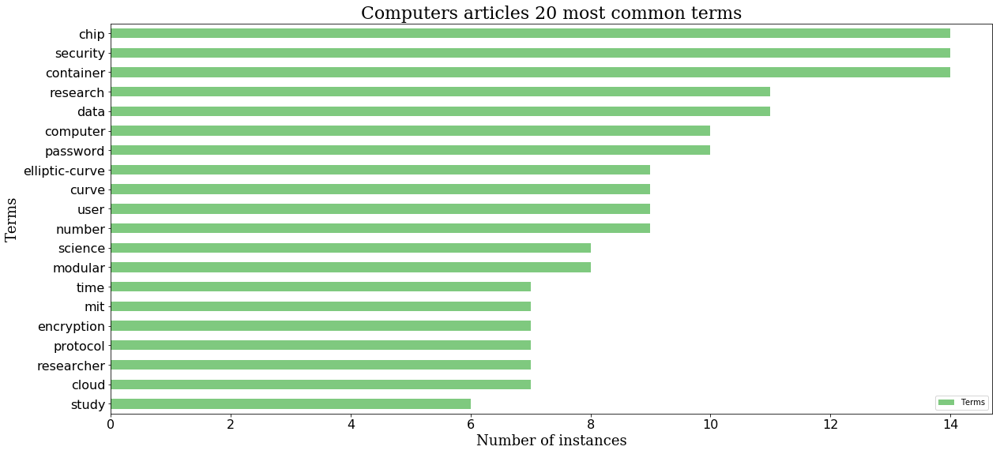
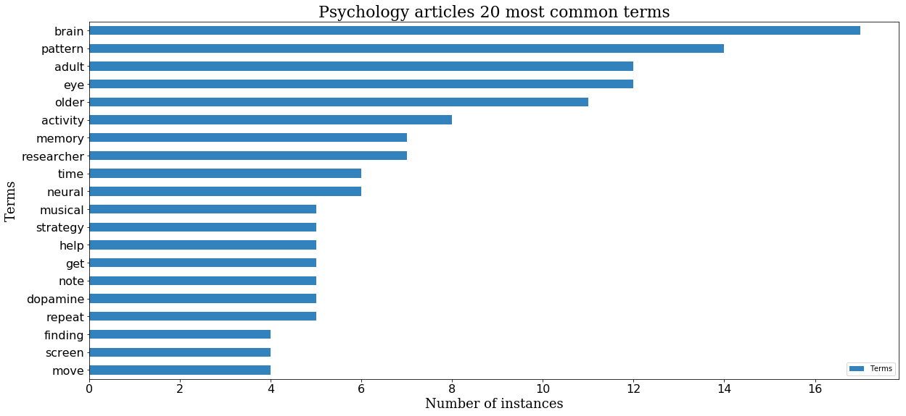
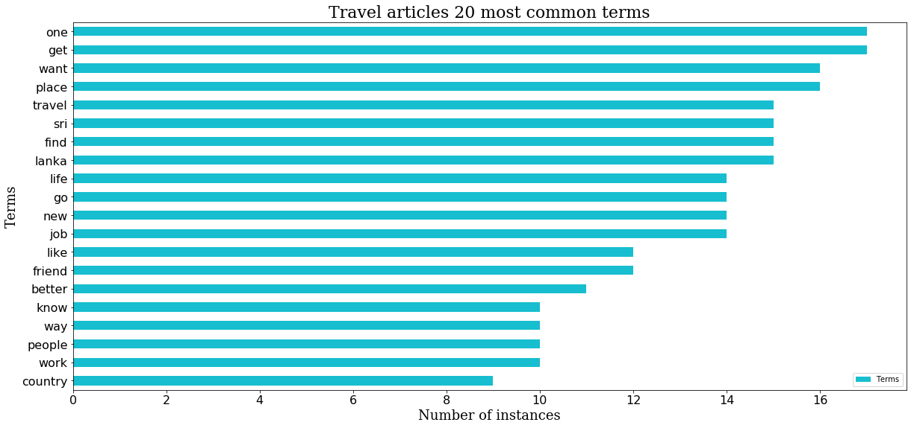
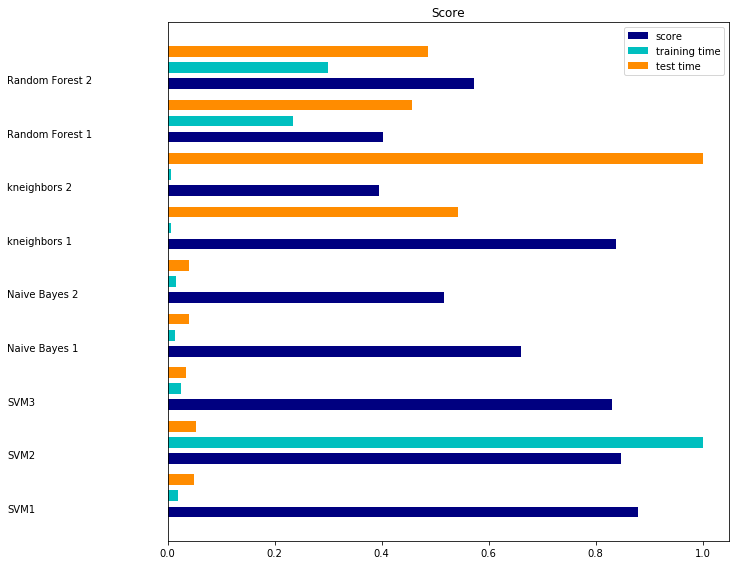

```python
% pylab inline
import pandas as pd
#import matplotlib as plt
warnings.filterwarnings("ignore",category=matplotlib.cbook.mplDeprecation)
import matplotlib.pyplot as plt
import numpy as np
import keras 
import sys
import string
#!pip3 install h5py
import h5py
import re

from sklearn.feature_extraction.text import TfidfVectorizer
from sklearn.model_selection import train_test_split
from keras import backend as K
K.set_image_dim_ordering('th')
#from keras.utils.data_utils import get_file
from keras.models import Sequential
from keras.layers import Dense
from keras.layers import Dropout
from keras.layers import LSTM
from keras.callbacks import ModelCheckpoint
from keras.utils import np_utils

from collections import Counter
from nltk.corpus import stopwords 
from nltk.stem.wordnet import WordNetLemmatizer

from keras.preprocessing.text import text_to_word_sequence
from keras.preprocessing.text import Tokenizer

from keras.layers.core import Dense, Activation
from keras.layers.embeddings import Embedding
from keras.layers.recurrent import LSTM
```

    Populating the interactive namespace from numpy and matplotlib


### some regular expressions to ease cleaning process


```python
another_str=r"(?:[a-zA-Z0-9#@][a-zA-Z0-9#@'\-_]+[a-zA-Z0-9#@])" # words with - and '
letters_without_numbers_str='[a-z\'A-Z][a-z\'A-Z0-9_-]*'
```

### functions


```python
def clean(words_string,operation,stop): 
    '''
    Returns a string after removing stop words and punctuations, lowering all characters and normalizing the words.
    operation=1 - getting list of words
    operation=2 - getting one body text
    stop=true - clean stop words
    '''
    if(operation==2):
        terms=re.findall(r'('+'|'.join([letters_without_numbers_str,another_str])+')',words_string)
        #terms=words_string.split()
    else:
        terms=words_string
        
    stop = set(stopwords.words('english'))
    
    exclude=list(string.punctuation)
    exclude=set(exclude)
    
    lemma = WordNetLemmatizer()
    terms=[term.lower() for term in terms]    
    if(stop):
        stop_free=[i.lower() for i in terms if i not in stop]
        punc_free=[i.lower() for i in stop_free if i not in exclude]
    else:
        punc_free=[i.lower() for i in terms if i not in exclude]

    
    normalized = [lemma.lemmatize(term) for term in punc_free]
    if (operation==1):
        return normalized
    return  " ".join(term for term in normalized)

def makeSeqFromList(seq_len,list_of_list_of_words,jump):
    '''
    input :
        seq_len - the length of the sequences we want to create
        list_of_list_of_words - a list containing lists of words.
        jump - the number of steps we want to jump from the previous sequence when creating the next sequence.
    output: list of sequences, list of the next word for each sequence from _input
    '''
    input_=[]
    output_=[]
    for list_of_words in list_of_list_of_words:
        a,b=makeSeq(seq_len,list_of_words,jump)
        input_.append(a)
        output_.append(b)
    return uniteLists(input_),uniteLists(output_)
        

def makeSeq(seq_len,text_mat,jump):
    '''
    input:
        seq_len = the length of the sequences we want to generate
        text_mat = words sequence , each item in the array represents a word
    output:
        input_ -array of sequences in length seq_len.
        output_-array of next words for sequnces from input_.
                output[i] has the next word for sequence input_[i] 
    '''
    input_=[]
    for i in range (0,((len(text_mat)-seq_len))//jump):
        input_.append(text_mat[i*jump:i*jump+seq_len])
    
    output_ = text_mat[seq_length:]
    return input_,output_


def uniteLists(list_of_lists_of_words):
    '''
    Doing flat reduce, returning only one list of strings 
    '''
    united=[]
    for list_of_words in list_of_lists_of_words:
        united+=list_of_words
    return united

def replaceConnectingChars(text):
    '''
    for sentence correction we replace some values with Constants.
    the reverse function is in part C - add_connecting_chars.
    '''
    unknown_token = "UNKNOWNTOKEN"
    sentence_start_token = "SENTENCESTART"
    sentence_end_token = "SENTENCEEND"
    line_break= "NEWLINE"
    separator= "SEPARATOR"

    text1 = text.replace('\n',' '+ line_break + ' ')
    text1 = text1.replace('--',' '+ separator + ' ')
    text1 = text1.replace('.',' '+sentence_end_token +' '+ sentence_start_token+' ' )
    return text1

def devideToTermsAndFreq(tfList):
    '''
    Returns all the terms and their frequencies in the given list.
    '''
    ans_terms=[]
    ans_freq=[]
    for key,val in tfList:
        ans_terms.append(key)
        ans_freq.append(val)
    return ans_terms,ans_freq

def createPlot(x_data,y_data,y_name,x_name,title,i,j,k,color,bartype):
    '''
    Prints a plot for the given inputs:
    x_data - an array for the x axes.
    y_data - an array for the y axes.
    y_name - the label for the y axes.
    x_name - the label for the x axes.
    title - title for the plot.
    i,j,k,color,bartype - some data for the decoration of the graph.
    '''
    axis_font = {'family': 'serif','color':  'black','weight': 'normal','size': 18,}
    title_font = {'family': 'serif','color':  'black','weight': 'normal','size': 22,}
    font_size=16
    df=pd.DataFrame(data={x_name:x_data,y_name:y_data})
    temp = df.pivot_table(values=y_name,index=x_data)
    temp.sort_values(by=(y_name), ascending=True,inplace=True)
    ax = fig.add_subplot(i,j,k) #121
    for tick in ax.xaxis.get_major_ticks():
        tick.label1.set_fontsize(font_size)
    for tick in ax.yaxis.get_major_ticks():
        tick.label1.set_fontsize(font_size)
    ax.set_xlabel(x_name,fontdict=axis_font)
    ax.set_ylabel(y_name,fontdict=axis_font)
    ax.set_title(title,fontdict=title_font)
    temp.plot(kind=bartype,ax=ax,cmap=color)

def create_text_mat(word_seq):
    '''
    creating one hot representation for word sequence.
    '''
    unique_text=list(set(word_seq))
    vocabulary_size = len(unique_text)

    token = Tokenizer(num_words=vocabulary_size,char_level=False,lower=False)
    token.fit_on_texts(unique_text)

    text_mat = token.texts_to_matrix(word_seq, mode='binary')
    return text_mat,token

```

# Part A - preparing our data 
## in this stage we will gather all the articles and make some text preprocessing

#### first we will read all our articles to vars


```python
random.seed(123)

pathComp=['Computers1.txt','Computers2.txt','Computers3.txt']
pathPsy=['Psychology1.txt','Psychology2.txt','Psychology3.txt']
pathTravel=['Travel1.txt','Travel2.txt','Travel3.txt']


allComp = [open('Docs/' + path).read() for path in pathComp]
allPsy = [open('Docs/'+path).read() for path in pathPsy]
allTravel = [open('Docs/'+path).read() for path in pathTravel]
```

## A1. prepare our datasets for the text generation model
we will use LSTM model for generating text so we will need to prepare out input and output for the model.
- **xSeqABC** - are **seq_length** length sequences of words from article ABC
- **ySeqABC** - ySeqABC[i] is the next word in sequence xSeqABC[i] in article ABC
- **xVecSeqABC** - same as **xSeqABC** only in one hot representation.
- **yVecSeqABC** - same as **ySeqABC** only in one hot representation.
- **mat_ABC** - is one hot vector representation for every word in ABC topic. 


```python
seq_length=10
jump=1
allCompWordSeq=[text_to_word_sequence(replaceConnectingChars(text) ,lower=False) for text in allComp]
allPsyWordSeq=[text_to_word_sequence(replaceConnectingChars(text) ,lower=False) for text in allPsy]
allTravelWordSeq=[text_to_word_sequence(replaceConnectingChars(text) ,lower=False) for text in allTravel]


mat_comp,token_comp=create_text_mat(uniteLists(allCompWordSeq))
mat_psy,token_psy=create_text_mat(uniteLists(allPsyWordSeq))
mat_travel,token_travel=create_text_mat(uniteLists(allTravelWordSeq))

xSeqComp,yWordComp=makeSeqFromList(seq_length,allCompWordSeq,jump)
xSeqPsy,yWordPsy=makeSeqFromList(seq_length,allPsyWordSeq,jump)
xSeqTravel,yWordTravel=makeSeqFromList(seq_length,allTravelWordSeq,jump)


xVecSeqComp,yVecSeqComp=makeSeq(seq_length,mat_comp,jump)
xVecSeqPsy,yVecSeqPsy=makeSeq(seq_length,mat_psy,jump)
xVecSeqTravel,yVecSeqTravel=makeSeq(seq_length,mat_travel,jump)
```

### create mapping from int to word
we will need this for translatting the prediction from our LSTM model.
the model will predict a vector of probabilities for each feature, we will take the index of the highest probability. putting that index to the dict bellow will give us a word fromt the vocabulary. 


```python
int_to_word_comp = dict((np.argmax(mat_comp[index]),w) for index,w in enumerate(uniteLists(allCompWordSeq)))
int_to_word_psy = dict((np.argmax(mat_psy[index]),w) for index,w in enumerate(uniteLists(allPsyWordSeq)))
int_to_word_travel = dict((np.argmax(mat_travel[index]),w) for index,w in enumerate(uniteLists(allTravelWordSeq)))
```

## A2. prepare our datasets for the sequence classification model
first we will clean the texts from stop words,punctuation and normilze it.

- **ABC_clean** - [ABC_text1,ABC_text2,ABC,text3] array of cleaned texts. the cleaning function is specified in the Functions cell.
- **ABC_clean_words** - [[ABC_text1_word_sequence],[ABC_text2_word_sequence],[ABC_text3_word_sequence]] as ABC_clean but the texts are seperated to words sequence


```python
my_filter='!"#$%&()*+,./:;<=>?@[\\]^_`{|}~\t\n'
comp_clean = [clean(text,2,True) for text in allComp]
comp_clean_words=[text_to_word_sequence(text,filters=my_filter) for text in comp_clean]

psy_clean = [clean(text,2,True) for text in allPsy]
psy_clean_words=[text_to_word_sequence(text,filters=my_filter) for text in psy_clean]

travel_clean = [clean(text,2,True) for text in allTravel]
travel_clean_words=[text_to_word_sequence(text,filters=my_filter) for text in travel_clean]
```

- **x_ABC_clean** - sequences of size **classification_seq_length** from articles in ABC. we used the function 'makeSeqFromList' from part A1.
- **y_ABC_clean** - target. The value we got from function 'makeSeqFromList' is usless because we are now making data for classification model and not text generation, so we will change it to hold the class representation of topic ABC : **0** - Computer **1** - Psychology **2** - Travel

bottom line -
**x_ABC_clean** holds the classification sequences for articles in topic ABC and **y_ABC_clean** holds the target values for each sequence in topic ABC 


```python
classification_seq_length=10

x_comp_clean,y_comp_clean=makeSeqFromList(classification_seq_length,comp_clean_words,classification_seq_length)
x_comp_clean=uniteLists([[" ".join(term for term in seq)] for seq in x_comp_clean])
y_comp_clean=[0]*len(x_comp_clean)

x_psy_clean,y_psy_clean=makeSeqFromList(classification_seq_length,psy_clean_words,classification_seq_length)
x_psy_clean=uniteLists([[" ".join(term for term in seq)] for seq in x_psy_clean])
y_psy_clean=[1]*len(x_psy_clean)

x_travel_clean,y_travel_clean=makeSeqFromList(classification_seq_length,travel_clean_words,classification_seq_length)
x_travel_clean=uniteLists([[" ".join(term for term in seq)] for seq in x_travel_clean])
y_travel_clean=[2]*len(x_travel_clean)
```

because we need our model to classify sequnces from all 3 articles we need to combine the above data


```python
all_seq_x=x_comp_clean+x_psy_clean+x_travel_clean
all_seq_y=y_comp_clean+y_psy_clean+y_travel_clean
```

### after we prepared our base data for both classification and generation models, we will check a little bit the terms frequencies for each topic.
- **words_tf_ABC** - a list of (term, number of appearnces for term) for each term in articles from topic ABC


```python
words_tf_comp=Counter(uniteLists(comp_clean_words)).most_common()
words_tf_psy=Counter(uniteLists(psy_clean_words)).most_common()
words_tf_travel=Counter(uniteLists(travel_clean_words)).most_common()

terms_comp,freq_comp=devideToTermsAndFreq(words_tf_comp)
terms_psy,freq_psy=devideToTermsAndFreq(words_tf_psy)
terms_travel,freq_travel=devideToTermsAndFreq(words_tf_travel)

```

### plotting  ***num*** most common words in Computers articles


```python
num=20
fig = plt.figure(figsize=(20,20))
createPlot(terms_comp[:num],freq_comp[:num],'Terms','Number of instances','Computers articles %s most common terms'%num ,2,1,1,'Accent','barh')
```





### plotting  ***num*** most common words in Psychology articles


```python
num=20
fig = plt.figure(figsize=(20,20))
createPlot(terms_psy[:num],freq_psy[:num],'Terms','Number of instances','Psychology articles %s most common terms'%num ,2,1,1,'Vega20c','barh')
```





### plotting ***num*** most common words in Travel articles


```python
num=20
fig = plt.figure(figsize=(20,20))
createPlot(terms_travel[:num],freq_travel[:num],'Terms','Number of instances','Travel articles %s most common terms'%num ,2,1,1,'Vega10_r','barh')
```





# Part B - building classification models

### Functions for part B


```python
#################################### change topic string to num and vice versa
def change_topic_to_num(word): 
    if word=='Computers':
        return 0 
    if word=='Psychology':
        return 1
    return 2
def change_num_to_topic(num):
    if num==0:
        return 'Computers' 
    if num==1:
        return 'Psychology' 
    return 'Travel' 
####################################

#################################### help us to run multiple classifiction algorithms easier.
def benchmark(clf,name,x_train,y_train,x_test,y_test): 
    scores = cross_val_score(clf, x_train, y_train, cv=5)
    t0 = time()
    clf.fit(x_train, y_train)
    train_time = time() - t0

    t0 = time()
    pred = clf.predict(x_test)
    test_time = time() - t0

    score = metrics.accuracy_score(y_test, pred)
    clf_descr = str(clf).split('(')[0]
    return clf,clf_descr,name, score, train_time, test_time
```

### because we created the data in a serial way we want to shufle it and split to random train/test lists.
we will do it using the train_test_split function from sklearn.model_selection package.


```python
corpus_train, corpus_test, Y_train, Y_test = train_test_split(all_seq_x,all_seq_y, test_size=0.4, random_state=42)
```

### next we will create the vectorizer to trasnform the test and train to vector representation.
the **Y_train** and **Y_test** are already in numeric representation.
<br/>we choose the dictionary size to be maximum 5000.


```python
my_pattern='('+'|'.join([letters_without_numbers_str,another_str])+')'

vectorizer= TfidfVectorizer(ngram_range=(1,2),lowercase=False,token_pattern=my_pattern,max_features=5000)

vectorizer.fit(corpus_train)
X_train = vectorizer.transform(corpus_train)
X_test = vectorizer.transform(corpus_test)
```

### we will use few classification algorithms and sum our conclusions in plot representation below.


```python
from sklearn.linear_model import SGDClassifier
from sklearn.naive_bayes import MultinomialNB
from sklearn.model_selection import cross_val_score
from sklearn.ensemble import RandomForestClassifier
from sklearn import svm
from sklearn.neighbors import KNeighborsClassifier
from time import time
from sklearn import metrics

results = []
SVM1=SGDClassifier(max_iter=5)
SVM2=SGDClassifier(max_iter=1000)
SVM3=svm.LinearSVC()
NB1=MultinomialNB(alpha=1.0)
NB2=MultinomialNB(alpha=2.0)
KN1 =KNeighborsClassifier(n_neighbors=5)
KN2 =KNeighborsClassifier(n_neighbors=140)
RF1 = RandomForestClassifier(max_depth=5)
RF2 = RandomForestClassifier(max_depth=2000)
for clf, clf_name in (
        (SVM1,"SVM1"),
        (SVM2,"SVM2"),
        (SVM3,"SVM3"),
        (NB1,"Naive Bayes 1"),
        (NB2,"Naive Bayes 2"),
        (KN1, "kneighbors 1"),
        (KN2, "kneighbors 2"),        
        (RF1,"Random Forest 1"),
        (RF2,"Random Forest 2")
    ):
    results.append(benchmark(clf,clf_name,X_train,Y_train,X_test,Y_test))
```


```python
results_grouped= [[x[i] for x in results] for i in range(6)]
indices = np.arange(len(results))
clf,clf_descr,clf_names, score, train_time, test_time = results_grouped
training_time = np.array(train_time) / np.max(train_time)
test_time = np.array(test_time) / np.max(test_time)

plt.figure(figsize=(12, 8))
plt.title("Score")
plt.barh(indices, score, .2, label="score", color='navy')
plt.barh(indices + .3, training_time, .2, label="training time",
         color='c')
plt.barh(indices + .6, test_time, .2, label="test time", color='darkorange')
plt.yticks(())
plt.legend(loc='best')
plt.subplots_adjust(left=.25)
plt.subplots_adjust(top=.95)
plt.subplots_adjust(bottom=.05)

for i, c in zip(indices, clf_names):
    plt.text(-.3, i, c)

plt.show()
```





### we will choose the classification model with the best result to be our classifier for Part D
**best_clf** - the classification model with the best result


```python
max_score=0
for result in results:
    if (result[3]>max_score):
        best_algo=result
        max_score=result[3]

best_clf=best_algo[0]
```

# Part C - generating text
here we will use the next data sets we created from part A :
- **xVecSeqABC** - one hot representation of sequences from topic ABC.
- **yVecSeqABC** - one hot representation of target values for sequences.
- **mat_ABC** - is one hot vector representation for every word in ABC topic. 
- **int_to_word_ABC** - dictionary that transforms index from the one hot representation to a word.

### Functions for part C


```python
def generate_text(int_to_word,input_,model,text_len):
    '''
    this function generates texts
        pattern - random sequence that will start our generated text.
        text_len - the number of words of the new generated text without the initial pattern.
    return :
        generated - our new generated text
    '''
    start = numpy.random.randint(0, len(input_)-1)
    pattern = input_[start]

    sentence=""
    for i in pattern:
         sentence=sentence+int_to_word[np.argmax(i)]+" "

    generated=sentence

    for i in range(text_len):
        x = numpy.reshape(pattern, (1, len(pattern), -1))
        #print ("x is : " , x)
        prediction =model.predict(x, verbose=0)
        #print ("prediction is : " , prediction)
        index = numpy.argmax(prediction)
        #print(index)
        generated=generated+int_to_word[index]
        generated=generated+" "
        pattern=np.concatenate((pattern, prediction))
        #print ("pattern is : " , pattern)
        pattern = pattern[1:len(pattern)]
    return generated

def create_model(X,output_,name):
    model = Sequential()
    model.add(LSTM(256, input_shape=(X.shape[1], X.shape[2]), return_sequences=True))
    model.add(Dropout(0.2))
    model.add(LSTM(256))
    model.add(Dropout(0.2))
    model.add(Dense(output_.shape[1], activation='softmax'))
    model.compile(loss='categorical_crossentropy', optimizer='adam',metrics=["accuracy"])

    filepath= name + "_one_hot_weights-improvement-{epoch:02d}-{loss:.4f}.hdf5"
    checkpoint = ModelCheckpoint(filepath, monitor='loss', verbose=1, save_best_only=True, mode='min')
    callbacks_list = [checkpoint]
    
    return model , callbacks_list

def add_connecting_chars(generated):
    final=re.sub("( SENTENCEEND)+",".",generated)
    final=re.sub("(SENTENCEEND )+","",final)
    final=re.sub("(SENTENCESTART )+" or "( SENTENCESTART)+","",final)
    final=final.replace(" SEPARATOR ","-")
    final=final.replace("NEWLINE ","")
    final=re.sub('[\s]+'," ",final)
    return final
def generate_list_text(int_to_word,input_,model,text_len):
    answer=[]
    for i in range (0,len(input_)//3):
        answer.append(add_connecting_chars(generate_text(int_to_word,input_,model,text_len)))
    return answer
```

to use the LSTM model we will need to reshape the input structure to [samples, time steps, features] or in our language - [number_of_sequnces,each_sequence_length,num of features] 


```python
n_patterns_comp=len(xVecSeqComp)
X_comp= numpy.reshape(xVecSeqComp, (n_patterns_comp,seq_length,-1))

n_patterns_psy=len(xVecSeqPsy)
X_psy= numpy.reshape(xVecSeqPsy, (n_patterns_psy,seq_length,-1))

n_patterns_travel=len(xVecSeqTravel)
X_travel= numpy.reshape(xVecSeqTravel, (n_patterns_travel,seq_length,-1))
```

### creating the model for each topic


```python
model_comp , callbacks_list_comp =create_model(X_comp,yVecSeqComp,"Computers")
model_psy , callbacks_list_psy=create_model(X_psy,yVecSeqPsy,"Psychology")
model_travel , callbacks_list_travel=create_model(X_travel,yVecSeqTravel,"Travel")
```

### training the models 
we are saving the best weights so in the future we won't need to train the model each time.
for the check you can skip this part and go stright to the loading weights part.


```python
#model_comp.fit(X_comp,yVecSeqComp, epochs=100, batch_size=128, callbacks=callbacks_list_comp,verbose=1)
```

    Epoch 1/100
    2153/2153 [==============================] - 13s 6ms/step - loss: 6.5723 - acc: 0.0413
    
    Epoch 00001: loss improved from inf to 6.57228, saving model to Computers_one_hot_weights-improvement-01-6.5723.hdf5
    Epoch 2/100
    2153/2153 [==============================] - 11s 5ms/step - loss: 5.9922 - acc: 0.0395
    
    Epoch 00002: loss improved from 6.57228 to 5.99216, saving model to Computers_one_hot_weights-improvement-02-5.9922.hdf5
    Epoch 3/100
    2153/2153 [==============================] - 11s 5ms/step - loss: 5.8668 - acc: 0.0451
    
    Epoch 00003: loss improved from 5.99216 to 5.86678, saving model to Computers_one_hot_weights-improvement-03-5.8668.hdf5
    Epoch 4/100
    2153/2153 [==============================] - 12s 6ms/step - loss: 5.8192 - acc: 0.0455
    
    Epoch 00004: loss improved from 5.86678 to 5.81923, saving model to Computers_one_hot_weights-improvement-04-5.8192.hdf5
    Epoch 5/100
    2153/2153 [==============================] - 10s 5ms/step - loss: 5.7764 - acc: 0.0478
    
    Epoch 00005: loss improved from 5.81923 to 5.77638, saving model to Computers_one_hot_weights-improvement-05-5.7764.hdf5
    Epoch 6/100
    2153/2153 [==============================] - 12s 6ms/step - loss: 5.7178 - acc: 0.0502
    
    Epoch 00006: loss improved from 5.77638 to 5.71780, saving model to Computers_one_hot_weights-improvement-06-5.7178.hdf5
    Epoch 7/100
    2153/2153 [==============================] - 12s 6ms/step - loss: 5.6547 - acc: 0.0511
    
    Epoch 00007: loss improved from 5.71780 to 5.65473, saving model to Computers_one_hot_weights-improvement-07-5.6547.hdf5
    Epoch 8/100
    2153/2153 [==============================] - 12s 6ms/step - loss: 5.5682 - acc: 0.0678
    
    Epoch 00008: loss improved from 5.65473 to 5.56818, saving model to Computers_one_hot_weights-improvement-08-5.5682.hdf5
    Epoch 9/100
    2153/2153 [==============================] - 14s 7ms/step - loss: 5.4611 - acc: 0.0799
    
    Epoch 00009: loss improved from 5.56818 to 5.46114, saving model to Computers_one_hot_weights-improvement-09-5.4611.hdf5
    Epoch 10/100
    2153/2153 [==============================] - 11s 5ms/step - loss: 5.3329 - acc: 0.1059
    
    Epoch 00010: loss improved from 5.46114 to 5.33292, saving model to Computers_one_hot_weights-improvement-10-5.3329.hdf5
    Epoch 11/100
    2153/2153 [==============================] - 13s 6ms/step - loss: 5.2097 - acc: 0.1064
    
    Epoch 00011: loss improved from 5.33292 to 5.20972, saving model to Computers_one_hot_weights-improvement-11-5.2097.hdf5
    Epoch 12/100
    2153/2153 [==============================] - 12s 6ms/step - loss: 5.0942 - acc: 0.1152
    
    Epoch 00012: loss improved from 5.20972 to 5.09418, saving model to Computers_one_hot_weights-improvement-12-5.0942.hdf5
    Epoch 13/100
    2153/2153 [==============================] - 13s 6ms/step - loss: 4.9779 - acc: 0.1263
    
    Epoch 00013: loss improved from 5.09418 to 4.97786, saving model to Computers_one_hot_weights-improvement-13-4.9779.hdf5
    Epoch 14/100
    2153/2153 [==============================] - 11s 5ms/step - loss: 4.8452 - acc: 0.1472
    
    Epoch 00014: loss improved from 4.97786 to 4.84523, saving model to Computers_one_hot_weights-improvement-14-4.8452.hdf5
    Epoch 15/100
    2153/2153 [==============================] - 12s 6ms/step - loss: 4.7122 - acc: 0.1584
    
    Epoch 00015: loss improved from 4.84523 to 4.71217, saving model to Computers_one_hot_weights-improvement-15-4.7122.hdf5
    Epoch 16/100
    2153/2153 [==============================] - 12s 6ms/step - loss: 4.6081 - acc: 0.1649
    
    Epoch 00016: loss improved from 4.71217 to 4.60814, saving model to Computers_one_hot_weights-improvement-16-4.6081.hdf5
    Epoch 17/100
    2153/2153 [==============================] - 12s 6ms/step - loss: 4.5103 - acc: 0.1565
    
    Epoch 00017: loss improved from 4.60814 to 4.51031, saving model to Computers_one_hot_weights-improvement-17-4.5103.hdf5
    Epoch 18/100
    2153/2153 [==============================] - 12s 6ms/step - loss: 4.3877 - acc: 0.1635
    
    Epoch 00018: loss improved from 4.51031 to 4.38767, saving model to Computers_one_hot_weights-improvement-18-4.3877.hdf5
    Epoch 19/100
    2153/2153 [==============================] - 12s 6ms/step - loss: 4.2421 - acc: 0.1821
    
    Epoch 00019: loss improved from 4.38767 to 4.24213, saving model to Computers_one_hot_weights-improvement-19-4.2421.hdf5
    Epoch 20/100
    2153/2153 [==============================] - 13s 6ms/step - loss: 4.1298 - acc: 0.1909
    
    Epoch 00020: loss improved from 4.24213 to 4.12981, saving model to Computers_one_hot_weights-improvement-20-4.1298.hdf5
    Epoch 21/100
    2153/2153 [==============================] - 16s 7ms/step - loss: 3.9893 - acc: 0.2118
    
    Epoch 00021: loss improved from 4.12981 to 3.98929, saving model to Computers_one_hot_weights-improvement-21-3.9893.hdf5
    Epoch 22/100
    2153/2153 [==============================] - 11s 5ms/step - loss: 3.8559 - acc: 0.2202
    
    Epoch 00022: loss improved from 3.98929 to 3.85587, saving model to Computers_one_hot_weights-improvement-22-3.8559.hdf5
    Epoch 23/100
    2153/2153 [==============================] - 12s 6ms/step - loss: 3.7465 - acc: 0.2281
    
    Epoch 00023: loss improved from 3.85587 to 3.74654, saving model to Computers_one_hot_weights-improvement-23-3.7465.hdf5
    Epoch 24/100
    2153/2153 [==============================] - 12s 6ms/step - loss: 3.6781 - acc: 0.2248
    
    Epoch 00024: loss improved from 3.74654 to 3.67811, saving model to Computers_one_hot_weights-improvement-24-3.6781.hdf5
    Epoch 25/100
    2153/2153 [==============================] - 14s 6ms/step - loss: 3.5563 - acc: 0.2420
    
    Epoch 00025: loss improved from 3.67811 to 3.55632, saving model to Computers_one_hot_weights-improvement-25-3.5563.hdf5
    Epoch 26/100
    2153/2153 [==============================] - 11s 5ms/step - loss: 3.4472 - acc: 0.2699
    
    Epoch 00026: loss improved from 3.55632 to 3.44724, saving model to Computers_one_hot_weights-improvement-26-3.4472.hdf5
    Epoch 27/100
    2153/2153 [==============================] - 13s 6ms/step - loss: 3.3572 - acc: 0.2731
    
    Epoch 00027: loss improved from 3.44724 to 3.35723, saving model to Computers_one_hot_weights-improvement-27-3.3572.hdf5
    Epoch 28/100
    2153/2153 [==============================] - 14s 6ms/step - loss: 3.2726 - acc: 0.2880
    
    Epoch 00028: loss improved from 3.35723 to 3.27257, saving model to Computers_one_hot_weights-improvement-28-3.2726.hdf5
    Epoch 29/100
    2153/2153 [==============================] - 13s 6ms/step - loss: 3.1708 - acc: 0.2959
    
    Epoch 00029: loss improved from 3.27257 to 3.17080, saving model to Computers_one_hot_weights-improvement-29-3.1708.hdf5
    Epoch 30/100
    2153/2153 [==============================] - 13s 6ms/step - loss: 3.0590 - acc: 0.3168
    
    Epoch 00030: loss improved from 3.17080 to 3.05898, saving model to Computers_one_hot_weights-improvement-30-3.0590.hdf5
    Epoch 31/100
    2153/2153 [==============================] - 12s 6ms/step - loss: 2.9685 - acc: 0.3377
    
    Epoch 00031: loss improved from 3.05898 to 2.96848, saving model to Computers_one_hot_weights-improvement-31-2.9685.hdf5
    Epoch 32/100
    2153/2153 [==============================] - 11s 5ms/step - loss: 2.8897 - acc: 0.3409
    
    Epoch 00032: loss improved from 2.96848 to 2.88971, saving model to Computers_one_hot_weights-improvement-32-2.8897.hdf5
    Epoch 33/100
    2153/2153 [==============================] - 14s 6ms/step - loss: 2.8010 - acc: 0.3558
    
    Epoch 00033: loss improved from 2.88971 to 2.80098, saving model to Computers_one_hot_weights-improvement-33-2.8010.hdf5
    Epoch 34/100
    2153/2153 [==============================] - 12s 6ms/step - loss: 2.7223 - acc: 0.3841
    
    Epoch 00034: loss improved from 2.80098 to 2.72231, saving model to Computers_one_hot_weights-improvement-34-2.7223.hdf5
    Epoch 35/100
    2153/2153 [==============================] - 13s 6ms/step - loss: 2.6067 - acc: 0.4036
    
    Epoch 00035: loss improved from 2.72231 to 2.60668, saving model to Computers_one_hot_weights-improvement-35-2.6067.hdf5
    Epoch 36/100
    2153/2153 [==============================] - 10s 5ms/step - loss: 2.5404 - acc: 0.4078
    
    Epoch 00036: loss improved from 2.60668 to 2.54038, saving model to Computers_one_hot_weights-improvement-36-2.5404.hdf5
    Epoch 37/100
    2153/2153 [==============================] - 13s 6ms/step - loss: 2.4668 - acc: 0.4259
    
    Epoch 00037: loss improved from 2.54038 to 2.46682, saving model to Computers_one_hot_weights-improvement-37-2.4668.hdf5
    Epoch 38/100
    2153/2153 [==============================] - 14s 6ms/step - loss: 2.3884 - acc: 0.4385
    
    Epoch 00038: loss improved from 2.46682 to 2.38839, saving model to Computers_one_hot_weights-improvement-38-2.3884.hdf5
    Epoch 39/100
    2153/2153 [==============================] - 12s 5ms/step - loss: 2.2942 - acc: 0.4705
    
    Epoch 00039: loss improved from 2.38839 to 2.29425, saving model to Computers_one_hot_weights-improvement-39-2.2942.hdf5
    Epoch 40/100
    2153/2153 [==============================] - 15s 7ms/step - loss: 2.2465 - acc: 0.4817
    
    Epoch 00040: loss improved from 2.29425 to 2.24648, saving model to Computers_one_hot_weights-improvement-40-2.2465.hdf5
    Epoch 41/100
    2153/2153 [==============================] - 12s 6ms/step - loss: 2.1952 - acc: 0.4998
    
    Epoch 00041: loss improved from 2.24648 to 2.19522, saving model to Computers_one_hot_weights-improvement-41-2.1952.hdf5
    Epoch 42/100
    2153/2153 [==============================] - 12s 5ms/step - loss: 2.1220 - acc: 0.5030
    
    Epoch 00042: loss improved from 2.19522 to 2.12205, saving model to Computers_one_hot_weights-improvement-42-2.1220.hdf5
    Epoch 43/100
    2153/2153 [==============================] - 12s 6ms/step - loss: 2.0534 - acc: 0.5179
    
    Epoch 00043: loss improved from 2.12205 to 2.05340, saving model to Computers_one_hot_weights-improvement-43-2.0534.hdf5
    Epoch 44/100
    2153/2153 [==============================] - 13s 6ms/step - loss: 1.9822 - acc: 0.5383
    
    Epoch 00044: loss improved from 2.05340 to 1.98218, saving model to Computers_one_hot_weights-improvement-44-1.9822.hdf5
    Epoch 45/100
    2153/2153 [==============================] - 14s 7ms/step - loss: 1.9063 - acc: 0.5592
    
    Epoch 00045: loss improved from 1.98218 to 1.90633, saving model to Computers_one_hot_weights-improvement-45-1.9063.hdf5
    Epoch 46/100
    2153/2153 [==============================] - 14s 6ms/step - loss: 1.8288 - acc: 0.5834
    
    Epoch 00046: loss improved from 1.90633 to 1.82884, saving model to Computers_one_hot_weights-improvement-46-1.8288.hdf5
    Epoch 47/100
    2153/2153 [==============================] - 13s 6ms/step - loss: 1.7620 - acc: 0.6075
    
    Epoch 00047: loss improved from 1.82884 to 1.76196, saving model to Computers_one_hot_weights-improvement-47-1.7620.hdf5
    Epoch 48/100
    2153/2153 [==============================] - 13s 6ms/step - loss: 1.6924 - acc: 0.6205
    
    Epoch 00048: loss improved from 1.76196 to 1.69244, saving model to Computers_one_hot_weights-improvement-48-1.6924.hdf5
    Epoch 49/100
    2153/2153 [==============================] - 12s 5ms/step - loss: 1.6468 - acc: 0.6447
    
    Epoch 00049: loss improved from 1.69244 to 1.64684, saving model to Computers_one_hot_weights-improvement-49-1.6468.hdf5
    Epoch 50/100
    2153/2153 [==============================] - 13s 6ms/step - loss: 1.5512 - acc: 0.6619
    
    Epoch 00050: loss improved from 1.64684 to 1.55118, saving model to Computers_one_hot_weights-improvement-50-1.5512.hdf5
    Epoch 51/100
    2153/2153 [==============================] - 12s 6ms/step - loss: 1.4885 - acc: 0.6721
    
    Epoch 00051: loss improved from 1.55118 to 1.48848, saving model to Computers_one_hot_weights-improvement-51-1.4885.hdf5
    Epoch 52/100
    2153/2153 [==============================] - 12s 5ms/step - loss: 1.4509 - acc: 0.6781
    
    Epoch 00052: loss improved from 1.48848 to 1.45085, saving model to Computers_one_hot_weights-improvement-52-1.4509.hdf5
    Epoch 53/100
    2153/2153 [==============================] - 13s 6ms/step - loss: 1.4108 - acc: 0.6948
    
    Epoch 00053: loss improved from 1.45085 to 1.41082, saving model to Computers_one_hot_weights-improvement-53-1.4108.hdf5
    Epoch 54/100
    2153/2153 [==============================] - 11s 5ms/step - loss: 1.3594 - acc: 0.7171
    
    Epoch 00054: loss improved from 1.41082 to 1.35940, saving model to Computers_one_hot_weights-improvement-54-1.3594.hdf5
    Epoch 55/100
    2153/2153 [==============================] - 13s 6ms/step - loss: 1.3009 - acc: 0.7315
    
    Epoch 00055: loss improved from 1.35940 to 1.30090, saving model to Computers_one_hot_weights-improvement-55-1.3009.hdf5
    Epoch 56/100
    2153/2153 [==============================] - 13s 6ms/step - loss: 1.2452 - acc: 0.7497
    
    Epoch 00056: loss improved from 1.30090 to 1.24516, saving model to Computers_one_hot_weights-improvement-56-1.2452.hdf5
    Epoch 57/100
    2153/2153 [==============================] - 12s 5ms/step - loss: 1.1901 - acc: 0.7557
    
    Epoch 00057: loss improved from 1.24516 to 1.19009, saving model to Computers_one_hot_weights-improvement-57-1.1901.hdf5
    Epoch 58/100
    2153/2153 [==============================] - 13s 6ms/step - loss: 1.1817 - acc: 0.7627
    
    Epoch 00058: loss improved from 1.19009 to 1.18170, saving model to Computers_one_hot_weights-improvement-58-1.1817.hdf5
    Epoch 59/100
    2153/2153 [==============================] - 13s 6ms/step - loss: 1.1477 - acc: 0.7636
    
    Epoch 00059: loss improved from 1.18170 to 1.14768, saving model to Computers_one_hot_weights-improvement-59-1.1477.hdf5
    Epoch 60/100
    2153/2153 [==============================] - 12s 6ms/step - loss: 1.0707 - acc: 0.7826
    
    Epoch 00060: loss improved from 1.14768 to 1.07073, saving model to Computers_one_hot_weights-improvement-60-1.0707.hdf5
    Epoch 61/100
    2153/2153 [==============================] - 12s 6ms/step - loss: 1.0147 - acc: 0.8086
    
    Epoch 00061: loss improved from 1.07073 to 1.01468, saving model to Computers_one_hot_weights-improvement-61-1.0147.hdf5
    Epoch 62/100
    2153/2153 [==============================] - 12s 6ms/step - loss: 0.9893 - acc: 0.8082
    
    Epoch 00062: loss improved from 1.01468 to 0.98934, saving model to Computers_one_hot_weights-improvement-62-0.9893.hdf5
    Epoch 63/100
    2153/2153 [==============================] - 12s 6ms/step - loss: 0.9932 - acc: 0.8128
    
    Epoch 00063: loss did not improve
    Epoch 64/100
    2153/2153 [==============================] - 13s 6ms/step - loss: 0.9622 - acc: 0.8203
    
    Epoch 00064: loss improved from 0.98934 to 0.96220, saving model to Computers_one_hot_weights-improvement-64-0.9622.hdf5
    Epoch 65/100
    2153/2153 [==============================] - 10s 5ms/step - loss: 0.9314 - acc: 0.8156
    
    Epoch 00065: loss improved from 0.96220 to 0.93140, saving model to Computers_one_hot_weights-improvement-65-0.9314.hdf5
    Epoch 66/100
    2153/2153 [==============================] - 14s 6ms/step - loss: 0.8417 - acc: 0.8537
    
    Epoch 00066: loss improved from 0.93140 to 0.84165, saving model to Computers_one_hot_weights-improvement-66-0.8417.hdf5
    Epoch 67/100
    2153/2153 [==============================] - 13s 6ms/step - loss: 0.8025 - acc: 0.8713
    
    Epoch 00067: loss improved from 0.84165 to 0.80246, saving model to Computers_one_hot_weights-improvement-67-0.8025.hdf5
    Epoch 68/100
    2153/2153 [==============================] - 13s 6ms/step - loss: 0.7505 - acc: 0.8769
    
    Epoch 00068: loss improved from 0.80246 to 0.75052, saving model to Computers_one_hot_weights-improvement-68-0.7505.hdf5
    Epoch 69/100
    2153/2153 [==============================] - 13s 6ms/step - loss: 0.7183 - acc: 0.8867
    
    Epoch 00069: loss improved from 0.75052 to 0.71829, saving model to Computers_one_hot_weights-improvement-69-0.7183.hdf5
    Epoch 70/100
    2153/2153 [==============================] - 13s 6ms/step - loss: 0.6719 - acc: 0.8918
    
    Epoch 00070: loss improved from 0.71829 to 0.67187, saving model to Computers_one_hot_weights-improvement-70-0.6719.hdf5
    Epoch 71/100
    2153/2153 [==============================] - 12s 6ms/step - loss: 0.6616 - acc: 0.8941
    
    Epoch 00071: loss improved from 0.67187 to 0.66162, saving model to Computers_one_hot_weights-improvement-71-0.6616.hdf5
    Epoch 72/100
    2153/2153 [==============================] - 13s 6ms/step - loss: 0.6532 - acc: 0.8992
    
    Epoch 00072: loss improved from 0.66162 to 0.65324, saving model to Computers_one_hot_weights-improvement-72-0.6532.hdf5
    Epoch 73/100
    2153/2153 [==============================] - 13s 6ms/step - loss: 0.6059 - acc: 0.9076
    
    Epoch 00073: loss improved from 0.65324 to 0.60588, saving model to Computers_one_hot_weights-improvement-73-0.6059.hdf5
    Epoch 74/100
    2153/2153 [==============================] - 11s 5ms/step - loss: 0.5773 - acc: 0.9141
    
    Epoch 00074: loss improved from 0.60588 to 0.57728, saving model to Computers_one_hot_weights-improvement-74-0.5773.hdf5
    Epoch 75/100
    2153/2153 [==============================] - 14s 7ms/step - loss: 0.5471 - acc: 0.9294
    
    Epoch 00075: loss improved from 0.57728 to 0.54712, saving model to Computers_one_hot_weights-improvement-75-0.5471.hdf5
    Epoch 76/100
    2153/2153 [==============================] - 12s 6ms/step - loss: 0.5356 - acc: 0.9271
    
    Epoch 00076: loss improved from 0.54712 to 0.53556, saving model to Computers_one_hot_weights-improvement-76-0.5356.hdf5
    Epoch 77/100
    2153/2153 [==============================] - 12s 6ms/step - loss: 0.5037 - acc: 0.9336
    
    Epoch 00077: loss improved from 0.53556 to 0.50372, saving model to Computers_one_hot_weights-improvement-77-0.5037.hdf5
    Epoch 78/100
    2153/2153 [==============================] - 14s 6ms/step - loss: 0.4813 - acc: 0.9368
    
    Epoch 00078: loss improved from 0.50372 to 0.48129, saving model to Computers_one_hot_weights-improvement-78-0.4813.hdf5
    Epoch 79/100
    2153/2153 [==============================] - 16s 7ms/step - loss: 0.4540 - acc: 0.9480
    
    Epoch 00079: loss improved from 0.48129 to 0.45402, saving model to Computers_one_hot_weights-improvement-79-0.4540.hdf5
    Epoch 80/100
    2153/2153 [==============================] - 12s 6ms/step - loss: 0.4392 - acc: 0.9452
    
    Epoch 00080: loss improved from 0.45402 to 0.43919, saving model to Computers_one_hot_weights-improvement-80-0.4392.hdf5
    Epoch 81/100
    2153/2153 [==============================] - 11s 5ms/step - loss: 0.4200 - acc: 0.9545
    
    Epoch 00081: loss improved from 0.43919 to 0.42004, saving model to Computers_one_hot_weights-improvement-81-0.4200.hdf5
    Epoch 82/100
    2153/2153 [==============================] - 13s 6ms/step - loss: 0.3981 - acc: 0.9582
    
    Epoch 00082: loss improved from 0.42004 to 0.39813, saving model to Computers_one_hot_weights-improvement-82-0.3981.hdf5
    Epoch 83/100
    2153/2153 [==============================] - 13s 6ms/step - loss: 0.3855 - acc: 0.9573
    
    Epoch 00083: loss improved from 0.39813 to 0.38547, saving model to Computers_one_hot_weights-improvement-83-0.3855.hdf5
    Epoch 84/100
    2153/2153 [==============================] - 13s 6ms/step - loss: 0.3706 - acc: 0.9619
    
    Epoch 00084: loss improved from 0.38547 to 0.37061, saving model to Computers_one_hot_weights-improvement-84-0.3706.hdf5
    Epoch 85/100
    2153/2153 [==============================] - 11s 5ms/step - loss: 0.3551 - acc: 0.9628
    
    Epoch 00085: loss improved from 0.37061 to 0.35506, saving model to Computers_one_hot_weights-improvement-85-0.3551.hdf5
    Epoch 86/100
    2153/2153 [==============================] - 13s 6ms/step - loss: 0.3403 - acc: 0.9628
    
    Epoch 00086: loss improved from 0.35506 to 0.34033, saving model to Computers_one_hot_weights-improvement-86-0.3403.hdf5
    Epoch 87/100
    2153/2153 [==============================] - 14s 6ms/step - loss: 0.3312 - acc: 0.9661
    
    Epoch 00087: loss improved from 0.34033 to 0.33120, saving model to Computers_one_hot_weights-improvement-87-0.3312.hdf5
    Epoch 88/100
    2153/2153 [==============================] - 12s 6ms/step - loss: 0.3297 - acc: 0.9670
    
    Epoch 00088: loss improved from 0.33120 to 0.32970, saving model to Computers_one_hot_weights-improvement-88-0.3297.hdf5
    Epoch 89/100
    2153/2153 [==============================] - 13s 6ms/step - loss: 0.3182 - acc: 0.9703
    
    Epoch 00089: loss improved from 0.32970 to 0.31825, saving model to Computers_one_hot_weights-improvement-89-0.3182.hdf5
    Epoch 90/100
    2153/2153 [==============================] - 13s 6ms/step - loss: 0.3069 - acc: 0.9721
    
    Epoch 00090: loss improved from 0.31825 to 0.30692, saving model to Computers_one_hot_weights-improvement-90-0.3069.hdf5
    Epoch 91/100
    2153/2153 [==============================] - 13s 6ms/step - loss: 0.3117 - acc: 0.9717
    
    Epoch 00091: loss did not improve
    Epoch 92/100
    2153/2153 [==============================] - 13s 6ms/step - loss: 0.2835 - acc: 0.9768
    
    Epoch 00092: loss improved from 0.30692 to 0.28354, saving model to Computers_one_hot_weights-improvement-92-0.2835.hdf5
    Epoch 93/100
    2153/2153 [==============================] - 13s 6ms/step - loss: 0.2633 - acc: 0.9800
    
    Epoch 00093: loss improved from 0.28354 to 0.26334, saving model to Computers_one_hot_weights-improvement-93-0.2633.hdf5
    Epoch 94/100
    2153/2153 [==============================] - 13s 6ms/step - loss: 0.2506 - acc: 0.9782
    
    Epoch 00094: loss improved from 0.26334 to 0.25057, saving model to Computers_one_hot_weights-improvement-94-0.2506.hdf5
    Epoch 95/100
    2153/2153 [==============================] - 13s 6ms/step - loss: 0.2228 - acc: 0.9865
    
    Epoch 00095: loss improved from 0.25057 to 0.22277, saving model to Computers_one_hot_weights-improvement-95-0.2228.hdf5
    Epoch 96/100
    2153/2153 [==============================] - 11s 5ms/step - loss: 0.2380 - acc: 0.9833
    
    Epoch 00096: loss did not improve
    Epoch 97/100
    2153/2153 [==============================] - 13s 6ms/step - loss: 0.2292 - acc: 0.9800
    
    Epoch 00097: loss did not improve
    Epoch 98/100
    2153/2153 [==============================] - 13s 6ms/step - loss: 0.2156 - acc: 0.9856
    
    Epoch 00098: loss improved from 0.22277 to 0.21559, saving model to Computers_one_hot_weights-improvement-98-0.2156.hdf5
    Epoch 99/100
    2153/2153 [==============================] - 12s 6ms/step - loss: 0.2237 - acc: 0.9824
    
    Epoch 00099: loss did not improve
    Epoch 100/100
    2153/2153 [==============================] - 13s 6ms/step - loss: 0.2068 - acc: 0.9814
    
    Epoch 00100: loss improved from 0.21559 to 0.20684, saving model to Computers_one_hot_weights-improvement-100-0.2068.hdf5


    <keras.callbacks.History at 0x7f35d6de5f28>


```python
#model_psy.fit(X_psy,yVecSeqPsy, epochs=100, batch_size=128, callbacks=callbacks_list_psy,verbose=1)
```

    Epoch 1/100
    1271/1271 [==============================] - 6s 4ms/step - loss: 6.1589 - acc: 0.0370
    
    Epoch 00001: loss improved from inf to 6.15892, saving model to Psychology_one_hot_weights-improvement-01-6.1589.hdf5
    Epoch 2/100
    1271/1271 [==============================] - 5s 4ms/step - loss: 5.7715 - acc: 0.0480
    
    Epoch 00002: loss improved from 6.15892 to 5.77153, saving model to Psychology_one_hot_weights-improvement-02-5.7715.hdf5
    Epoch 3/100
    1271/1271 [==============================] - 4s 3ms/step - loss: 5.5014 - acc: 0.0338
    
    Epoch 00003: loss improved from 5.77153 to 5.50139, saving model to Psychology_one_hot_weights-improvement-03-5.5014.hdf5
    Epoch 4/100
    1271/1271 [==============================] - 7s 5ms/step - loss: 5.4567 - acc: 0.0433
    
    Epoch 00004: loss improved from 5.50139 to 5.45672, saving model to Psychology_one_hot_weights-improvement-04-5.4567.hdf5
    Epoch 5/100
    1271/1271 [==============================] - 5s 4ms/step - loss: 5.4167 - acc: 0.0433
    
    Epoch 00005: loss improved from 5.45672 to 5.41666, saving model to Psychology_one_hot_weights-improvement-05-5.4167.hdf5
    Epoch 6/100
    1271/1271 [==============================] - 5s 4ms/step - loss: 5.3538 - acc: 0.0535
    
    Epoch 00006: loss improved from 5.41666 to 5.35376, saving model to Psychology_one_hot_weights-improvement-06-5.3538.hdf5
    Epoch 7/100
    1271/1271 [==============================] - 5s 4ms/step - loss: 5.3021 - acc: 0.0677
    
    Epoch 00007: loss improved from 5.35376 to 5.30210, saving model to Psychology_one_hot_weights-improvement-07-5.3021.hdf5
    Epoch 8/100
    1271/1271 [==============================] - 7s 5ms/step - loss: 5.2391 - acc: 0.0724
    
    Epoch 00008: loss improved from 5.30210 to 5.23915, saving model to Psychology_one_hot_weights-improvement-08-5.2391.hdf5
    Epoch 9/100
    1271/1271 [==============================] - 5s 4ms/step - loss: 5.1634 - acc: 0.0803
    
    Epoch 00009: loss improved from 5.23915 to 5.16345, saving model to Psychology_one_hot_weights-improvement-09-5.1634.hdf5
    Epoch 10/100
    1271/1271 [==============================] - 7s 6ms/step - loss: 5.0661 - acc: 0.0889
    
    Epoch 00010: loss improved from 5.16345 to 5.06606, saving model to Psychology_one_hot_weights-improvement-10-5.0661.hdf5
    Epoch 11/100
    1271/1271 [==============================] - 5s 4ms/step - loss: 4.9692 - acc: 0.0921
    
    Epoch 00011: loss improved from 5.06606 to 4.96925, saving model to Psychology_one_hot_weights-improvement-11-4.9692.hdf5
    Epoch 12/100
    1271/1271 [==============================] - 7s 6ms/step - loss: 4.8520 - acc: 0.1062
    
    Epoch 00012: loss improved from 4.96925 to 4.85201, saving model to Psychology_one_hot_weights-improvement-12-4.8520.hdf5
    Epoch 13/100
    1271/1271 [==============================] - 6s 4ms/step - loss: 4.7409 - acc: 0.1188
    
    Epoch 00013: loss improved from 4.85201 to 4.74091, saving model to Psychology_one_hot_weights-improvement-13-4.7409.hdf5
    Epoch 14/100
    1271/1271 [==============================] - 7s 5ms/step - loss: 4.5977 - acc: 0.1377
    
    Epoch 00014: loss improved from 4.74091 to 4.59773, saving model to Psychology_one_hot_weights-improvement-14-4.5977.hdf5
    Epoch 15/100
    1271/1271 [==============================] - 5s 4ms/step - loss: 4.4967 - acc: 0.1463
    
    Epoch 00015: loss improved from 4.59773 to 4.49668, saving model to Psychology_one_hot_weights-improvement-15-4.4967.hdf5
    Epoch 16/100
    1271/1271 [==============================] - 7s 5ms/step - loss: 4.3720 - acc: 0.1432
    
    Epoch 00016: loss improved from 4.49668 to 4.37196, saving model to Psychology_one_hot_weights-improvement-16-4.3720.hdf5
    Epoch 17/100
    1271/1271 [==============================] - 5s 4ms/step - loss: 4.2178 - acc: 0.1660
    
    Epoch 00017: loss improved from 4.37196 to 4.21779, saving model to Psychology_one_hot_weights-improvement-17-4.2178.hdf5
    Epoch 18/100
    1271/1271 [==============================] - 5s 4ms/step - loss: 4.0745 - acc: 0.1888
    
    Epoch 00018: loss improved from 4.21779 to 4.07455, saving model to Psychology_one_hot_weights-improvement-18-4.0745.hdf5
    Epoch 19/100
    1271/1271 [==============================] - 7s 5ms/step - loss: 3.9689 - acc: 0.1904
    
    Epoch 00019: loss improved from 4.07455 to 3.96893, saving model to Psychology_one_hot_weights-improvement-19-3.9689.hdf5
    Epoch 20/100
    1271/1271 [==============================] - 5s 4ms/step - loss: 3.8857 - acc: 0.2093
    
    Epoch 00020: loss improved from 3.96893 to 3.88566, saving model to Psychology_one_hot_weights-improvement-20-3.8857.hdf5
    Epoch 21/100
    1271/1271 [==============================] - 5s 4ms/step - loss: 3.7865 - acc: 0.1998
    
    Epoch 00021: loss improved from 3.88566 to 3.78652, saving model to Psychology_one_hot_weights-improvement-21-3.7865.hdf5
    Epoch 22/100
    1271/1271 [==============================] - 5s 4ms/step - loss: 3.6502 - acc: 0.2148
    
    Epoch 00022: loss improved from 3.78652 to 3.65017, saving model to Psychology_one_hot_weights-improvement-22-3.6502.hdf5
    Epoch 23/100
    1271/1271 [==============================] - 5s 4ms/step - loss: 3.5659 - acc: 0.2250
    
    Epoch 00023: loss improved from 3.65017 to 3.56588, saving model to Psychology_one_hot_weights-improvement-23-3.5659.hdf5
    Epoch 24/100
    1271/1271 [==============================] - 7s 5ms/step - loss: 3.4240 - acc: 0.2392
    
    Epoch 00024: loss improved from 3.56588 to 3.42401, saving model to Psychology_one_hot_weights-improvement-24-3.4240.hdf5
    Epoch 25/100
    1271/1271 [==============================] - 5s 4ms/step - loss: 3.2857 - acc: 0.2581
    
    Epoch 00025: loss improved from 3.42401 to 3.28568, saving model to Psychology_one_hot_weights-improvement-25-3.2857.hdf5
    Epoch 26/100
    1271/1271 [==============================] - 7s 5ms/step - loss: 3.1767 - acc: 0.2809
    
    Epoch 00026: loss improved from 3.28568 to 3.17667, saving model to Psychology_one_hot_weights-improvement-26-3.1767.hdf5
    Epoch 27/100
    1271/1271 [==============================] - 5s 4ms/step - loss: 3.0917 - acc: 0.2801
    
    Epoch 00027: loss improved from 3.17667 to 3.09169, saving model to Psychology_one_hot_weights-improvement-27-3.0917.hdf5
    Epoch 28/100
    1271/1271 [==============================] - 7s 5ms/step - loss: 2.9836 - acc: 0.3037
    
    Epoch 00028: loss improved from 3.09169 to 2.98358, saving model to Psychology_one_hot_weights-improvement-28-2.9836.hdf5
    Epoch 29/100
    1271/1271 [==============================] - 4s 3ms/step - loss: 2.8881 - acc: 0.3297
    
    Epoch 00029: loss improved from 2.98358 to 2.88812, saving model to Psychology_one_hot_weights-improvement-29-2.8881.hdf5
    Epoch 30/100
    1271/1271 [==============================] - 8s 6ms/step - loss: 2.7907 - acc: 0.3289
    
    Epoch 00030: loss improved from 2.88812 to 2.79068, saving model to Psychology_one_hot_weights-improvement-30-2.7907.hdf5
    Epoch 31/100
    1271/1271 [==============================] - 6s 5ms/step - loss: 2.6934 - acc: 0.3580
    
    Epoch 00031: loss improved from 2.79068 to 2.69335, saving model to Psychology_one_hot_weights-improvement-31-2.6934.hdf5
    Epoch 32/100
    1271/1271 [==============================] - 5s 4ms/step - loss: 2.5765 - acc: 0.3682
    
    Epoch 00032: loss improved from 2.69335 to 2.57653, saving model to Psychology_one_hot_weights-improvement-32-2.5765.hdf5
    Epoch 33/100
    1271/1271 [==============================] - 7s 6ms/step - loss: 2.4462 - acc: 0.4146
    
    Epoch 00033: loss improved from 2.57653 to 2.44623, saving model to Psychology_one_hot_weights-improvement-33-2.4462.hdf5
    Epoch 34/100
    1271/1271 [==============================] - 6s 4ms/step - loss: 2.3395 - acc: 0.4296
    
    Epoch 00034: loss improved from 2.44623 to 2.33949, saving model to Psychology_one_hot_weights-improvement-34-2.3395.hdf5
    Epoch 35/100
    1271/1271 [==============================] - 7s 6ms/step - loss: 2.2638 - acc: 0.4343
    
    Epoch 00035: loss improved from 2.33949 to 2.26377, saving model to Psychology_one_hot_weights-improvement-35-2.2638.hdf5
    Epoch 36/100
    1271/1271 [==============================] - 5s 4ms/step - loss: 2.1835 - acc: 0.4689
    
    Epoch 00036: loss improved from 2.26377 to 2.18354, saving model to Psychology_one_hot_weights-improvement-36-2.1835.hdf5
    Epoch 37/100
    1271/1271 [==============================] - 5s 4ms/step - loss: 2.0957 - acc: 0.5035
    
    Epoch 00037: loss improved from 2.18354 to 2.09565, saving model to Psychology_one_hot_weights-improvement-37-2.0957.hdf5
    Epoch 38/100
    1271/1271 [==============================] - 8s 6ms/step - loss: 2.0214 - acc: 0.5193
    
    Epoch 00038: loss improved from 2.09565 to 2.02143, saving model to Psychology_one_hot_weights-improvement-38-2.0214.hdf5
    Epoch 39/100
    1271/1271 [==============================] - 6s 5ms/step - loss: 1.8986 - acc: 0.5555
    
    Epoch 00039: loss improved from 2.02143 to 1.89856, saving model to Psychology_one_hot_weights-improvement-39-1.8986.hdf5
    Epoch 40/100
    1271/1271 [==============================] - 5s 4ms/step - loss: 1.8231 - acc: 0.5641
    
    Epoch 00040: loss improved from 1.89856 to 1.82311, saving model to Psychology_one_hot_weights-improvement-40-1.8231.hdf5
    Epoch 41/100
    1271/1271 [==============================] - 5s 4ms/step - loss: 1.7138 - acc: 0.6042
    
    Epoch 00041: loss improved from 1.82311 to 1.71376, saving model to Psychology_one_hot_weights-improvement-41-1.7138.hdf5
    Epoch 42/100
    1271/1271 [==============================] - 7s 6ms/step - loss: 1.5998 - acc: 0.6507
    
    Epoch 00042: loss improved from 1.71376 to 1.59976, saving model to Psychology_one_hot_weights-improvement-42-1.5998.hdf5
    Epoch 43/100
    1271/1271 [==============================] - 5s 4ms/step - loss: 1.5402 - acc: 0.6633
    
    Epoch 00043: loss improved from 1.59976 to 1.54019, saving model to Psychology_one_hot_weights-improvement-43-1.5402.hdf5
    Epoch 44/100
    1271/1271 [==============================] - 7s 6ms/step - loss: 1.4645 - acc: 0.6845
    
    Epoch 00044: loss improved from 1.54019 to 1.46447, saving model to Psychology_one_hot_weights-improvement-44-1.4645.hdf5
    Epoch 45/100
    1271/1271 [==============================] - 6s 5ms/step - loss: 1.3951 - acc: 0.7097
    
    Epoch 00045: loss improved from 1.46447 to 1.39514, saving model to Psychology_one_hot_weights-improvement-45-1.3951.hdf5
    Epoch 46/100
    1271/1271 [==============================] - 7s 6ms/step - loss: 1.3221 - acc: 0.7333
    
    Epoch 00046: loss improved from 1.39514 to 1.32213, saving model to Psychology_one_hot_weights-improvement-46-1.3221.hdf5
    Epoch 47/100
    1271/1271 [==============================] - 6s 4ms/step - loss: 1.2312 - acc: 0.7640
    
    Epoch 00047: loss improved from 1.32213 to 1.23124, saving model to Psychology_one_hot_weights-improvement-47-1.2312.hdf5
    Epoch 48/100
    1271/1271 [==============================] - 6s 4ms/step - loss: 1.1881 - acc: 0.7710
    
    Epoch 00048: loss improved from 1.23124 to 1.18808, saving model to Psychology_one_hot_weights-improvement-48-1.1881.hdf5
    Epoch 49/100
    1271/1271 [==============================] - 7s 6ms/step - loss: 1.1336 - acc: 0.7884
    
    Epoch 00049: loss improved from 1.18808 to 1.13360, saving model to Psychology_one_hot_weights-improvement-49-1.1336.hdf5
    Epoch 50/100
    1271/1271 [==============================] - 5s 4ms/step - loss: 1.0812 - acc: 0.8065
    
    Epoch 00050: loss improved from 1.13360 to 1.08116, saving model to Psychology_one_hot_weights-improvement-50-1.0812.hdf5
    Epoch 51/100
    1271/1271 [==============================] - 8s 6ms/step - loss: 1.0156 - acc: 0.8277
    
    Epoch 00051: loss improved from 1.08116 to 1.01565, saving model to Psychology_one_hot_weights-improvement-51-1.0156.hdf5
    Epoch 52/100
    1271/1271 [==============================] - 6s 5ms/step - loss: 0.9737 - acc: 0.8387
    
    Epoch 00052: loss improved from 1.01565 to 0.97370, saving model to Psychology_one_hot_weights-improvement-52-0.9737.hdf5
    Epoch 53/100
    1271/1271 [==============================] - 5s 4ms/step - loss: 0.9133 - acc: 0.8489
    
    Epoch 00053: loss improved from 0.97370 to 0.91330, saving model to Psychology_one_hot_weights-improvement-53-0.9133.hdf5
    Epoch 54/100
    1271/1271 [==============================] - 7s 6ms/step - loss: 0.8582 - acc: 0.8733
    
    Epoch 00054: loss improved from 0.91330 to 0.85819, saving model to Psychology_one_hot_weights-improvement-54-0.8582.hdf5
    Epoch 55/100
    1271/1271 [==============================] - 5s 4ms/step - loss: 0.8158 - acc: 0.8828
    
    Epoch 00055: loss improved from 0.85819 to 0.81584, saving model to Psychology_one_hot_weights-improvement-55-0.8158.hdf5
    Epoch 56/100
    1271/1271 [==============================] - 7s 5ms/step - loss: 0.8048 - acc: 0.8773
    
    Epoch 00056: loss improved from 0.81584 to 0.80481, saving model to Psychology_one_hot_weights-improvement-56-0.8048.hdf5
    Epoch 57/100
    1271/1271 [==============================] - 5s 4ms/step - loss: 0.7691 - acc: 0.8906
    
    Epoch 00057: loss improved from 0.80481 to 0.76910, saving model to Psychology_one_hot_weights-improvement-57-0.7691.hdf5
    Epoch 58/100
    1271/1271 [==============================] - 7s 5ms/step - loss: 0.7211 - acc: 0.8954
    
    Epoch 00058: loss improved from 0.76910 to 0.72111, saving model to Psychology_one_hot_weights-improvement-58-0.7211.hdf5
    Epoch 59/100
    1271/1271 [==============================] - 6s 5ms/step - loss: 0.6752 - acc: 0.9111
    
    Epoch 00059: loss improved from 0.72111 to 0.67515, saving model to Psychology_one_hot_weights-improvement-59-0.6752.hdf5
    Epoch 60/100
    1271/1271 [==============================] - 7s 6ms/step - loss: 0.6266 - acc: 0.9135
    
    Epoch 00060: loss improved from 0.67515 to 0.62659, saving model to Psychology_one_hot_weights-improvement-60-0.6266.hdf5
    Epoch 61/100
    1271/1271 [==============================] - 5s 4ms/step - loss: 0.6007 - acc: 0.9268
    
    Epoch 00061: loss improved from 0.62659 to 0.60074, saving model to Psychology_one_hot_weights-improvement-61-0.6007.hdf5
    Epoch 62/100
    1271/1271 [==============================] - 5s 4ms/step - loss: 0.5800 - acc: 0.9221
    
    Epoch 00062: loss improved from 0.60074 to 0.57997, saving model to Psychology_one_hot_weights-improvement-62-0.5800.hdf5
    Epoch 63/100
    1271/1271 [==============================] - 7s 5ms/step - loss: 0.5372 - acc: 0.9300
    
    Epoch 00063: loss improved from 0.57997 to 0.53716, saving model to Psychology_one_hot_weights-improvement-63-0.5372.hdf5
    Epoch 64/100
    1271/1271 [==============================] - 6s 5ms/step - loss: 0.5005 - acc: 0.9457
    
    Epoch 00064: loss improved from 0.53716 to 0.50054, saving model to Psychology_one_hot_weights-improvement-64-0.5005.hdf5
    Epoch 65/100
    1271/1271 [==============================] - 6s 5ms/step - loss: 0.4680 - acc: 0.9481
    
    Epoch 00065: loss improved from 0.50054 to 0.46797, saving model to Psychology_one_hot_weights-improvement-65-0.4680.hdf5
    Epoch 66/100
    1271/1271 [==============================] - 7s 5ms/step - loss: 0.4295 - acc: 0.9662
    
    Epoch 00066: loss improved from 0.46797 to 0.42945, saving model to Psychology_one_hot_weights-improvement-66-0.4295.hdf5
    Epoch 67/100
    1271/1271 [==============================] - 6s 5ms/step - loss: 0.4208 - acc: 0.9670
    
    Epoch 00067: loss improved from 0.42945 to 0.42076, saving model to Psychology_one_hot_weights-improvement-67-0.4208.hdf5
    Epoch 68/100
    1271/1271 [==============================] - 6s 4ms/step - loss: 0.4024 - acc: 0.9654
    
    Epoch 00068: loss improved from 0.42076 to 0.40236, saving model to Psychology_one_hot_weights-improvement-68-0.4024.hdf5
    Epoch 69/100
    1271/1271 [==============================] - 6s 4ms/step - loss: 0.3760 - acc: 0.9693
    
    Epoch 00069: loss improved from 0.40236 to 0.37595, saving model to Psychology_one_hot_weights-improvement-69-0.3760.hdf5
    Epoch 70/100
    1271/1271 [==============================] - 7s 5ms/step - loss: 0.3664 - acc: 0.9646
    
    Epoch 00070: loss improved from 0.37595 to 0.36641, saving model to Psychology_one_hot_weights-improvement-70-0.3664.hdf5
    Epoch 71/100
    1271/1271 [==============================] - 6s 4ms/step - loss: 0.3434 - acc: 0.9756
    
    Epoch 00071: loss improved from 0.36641 to 0.34341, saving model to Psychology_one_hot_weights-improvement-71-0.3434.hdf5
    Epoch 72/100
    1271/1271 [==============================] - 7s 6ms/step - loss: 0.3400 - acc: 0.9670
    
    Epoch 00072: loss improved from 0.34341 to 0.33996, saving model to Psychology_one_hot_weights-improvement-72-0.3400.hdf5
    Epoch 73/100
    1271/1271 [==============================] - 6s 4ms/step - loss: 0.3011 - acc: 0.9788
    
    Epoch 00073: loss improved from 0.33996 to 0.30112, saving model to Psychology_one_hot_weights-improvement-73-0.3011.hdf5
    Epoch 74/100
    1271/1271 [==============================] - 7s 6ms/step - loss: 0.2864 - acc: 0.9843
    
    Epoch 00074: loss improved from 0.30112 to 0.28636, saving model to Psychology_one_hot_weights-improvement-74-0.2864.hdf5
    Epoch 75/100
    1271/1271 [==============================] - 6s 4ms/step - loss: 0.2767 - acc: 0.9843
    
    Epoch 00075: loss improved from 0.28636 to 0.27670, saving model to Psychology_one_hot_weights-improvement-75-0.2767.hdf5
    Epoch 76/100
    1271/1271 [==============================] - 5s 4ms/step - loss: 0.2621 - acc: 0.9882
    
    Epoch 00076: loss improved from 0.27670 to 0.26211, saving model to Psychology_one_hot_weights-improvement-76-0.2621.hdf5
    Epoch 77/100
    1271/1271 [==============================] - 6s 4ms/step - loss: 0.2603 - acc: 0.9866
    
    Epoch 00077: loss improved from 0.26211 to 0.26027, saving model to Psychology_one_hot_weights-improvement-77-0.2603.hdf5
    Epoch 78/100
    1271/1271 [==============================] - 6s 4ms/step - loss: 0.2514 - acc: 0.9890
    
    Epoch 00078: loss improved from 0.26027 to 0.25143, saving model to Psychology_one_hot_weights-improvement-78-0.2514.hdf5
    Epoch 79/100
    1271/1271 [==============================] - 6s 5ms/step - loss: 0.2316 - acc: 0.9882
    
    Epoch 00079: loss improved from 0.25143 to 0.23157, saving model to Psychology_one_hot_weights-improvement-79-0.2316.hdf5
    Epoch 80/100
    1271/1271 [==============================] - 8s 6ms/step - loss: 0.2098 - acc: 0.9898
    
    Epoch 00080: loss improved from 0.23157 to 0.20983, saving model to Psychology_one_hot_weights-improvement-80-0.2098.hdf5
    Epoch 81/100
    1271/1271 [==============================] - 5s 4ms/step - loss: 0.2076 - acc: 0.9953
    
    Epoch 00081: loss improved from 0.20983 to 0.20755, saving model to Psychology_one_hot_weights-improvement-81-0.2076.hdf5
    Epoch 82/100
    1271/1271 [==============================] - 6s 5ms/step - loss: 0.2009 - acc: 0.9937
    
    Epoch 00082: loss improved from 0.20755 to 0.20094, saving model to Psychology_one_hot_weights-improvement-82-0.2009.hdf5
    Epoch 83/100
    1271/1271 [==============================] - 6s 5ms/step - loss: 0.1865 - acc: 0.9898
    
    Epoch 00083: loss improved from 0.20094 to 0.18645, saving model to Psychology_one_hot_weights-improvement-83-0.1865.hdf5
    Epoch 84/100
    1271/1271 [==============================] - 6s 5ms/step - loss: 0.1835 - acc: 0.9929
    
    Epoch 00084: loss improved from 0.18645 to 0.18351, saving model to Psychology_one_hot_weights-improvement-84-0.1835.hdf5
    Epoch 85/100
    1271/1271 [==============================] - 7s 5ms/step - loss: 0.1768 - acc: 0.9937
    
    Epoch 00085: loss improved from 0.18351 to 0.17679, saving model to Psychology_one_hot_weights-improvement-85-0.1768.hdf5
    Epoch 86/100
    1271/1271 [==============================] - 5s 4ms/step - loss: 0.1653 - acc: 0.9961
    
    Epoch 00086: loss improved from 0.17679 to 0.16533, saving model to Psychology_one_hot_weights-improvement-86-0.1653.hdf5
    Epoch 87/100
    1271/1271 [==============================] - 9s 7ms/step - loss: 0.1542 - acc: 0.9961
    
    Epoch 00087: loss improved from 0.16533 to 0.15418, saving model to Psychology_one_hot_weights-improvement-87-0.1542.hdf5
    Epoch 88/100
    1271/1271 [==============================] - 7s 5ms/step - loss: 0.1501 - acc: 0.9969
    
    Epoch 00088: loss improved from 0.15418 to 0.15012, saving model to Psychology_one_hot_weights-improvement-88-0.1501.hdf5
    Epoch 89/100
    1271/1271 [==============================] - 5s 4ms/step - loss: 0.1480 - acc: 0.9945
    
    Epoch 00089: loss improved from 0.15012 to 0.14798, saving model to Psychology_one_hot_weights-improvement-89-0.1480.hdf5
    Epoch 90/100
    1271/1271 [==============================] - 9s 7ms/step - loss: 0.1377 - acc: 0.9969
    
    Epoch 00090: loss improved from 0.14798 to 0.13771, saving model to Psychology_one_hot_weights-improvement-90-0.1377.hdf5
    Epoch 91/100
    1271/1271 [==============================] - 6s 5ms/step - loss: 0.1340 - acc: 0.9969
    
    Epoch 00091: loss improved from 0.13771 to 0.13398, saving model to Psychology_one_hot_weights-improvement-91-0.1340.hdf5
    Epoch 92/100
    1271/1271 [==============================] - 9s 7ms/step - loss: 0.1309 - acc: 0.9969
    
    Epoch 00092: loss improved from 0.13398 to 0.13087, saving model to Psychology_one_hot_weights-improvement-92-0.1309.hdf5
    Epoch 93/100
    1271/1271 [==============================] - 7s 5ms/step - loss: 0.1338 - acc: 0.9953
    
    Epoch 00093: loss did not improve
    Epoch 94/100
    1271/1271 [==============================] - 5s 4ms/step - loss: 0.1307 - acc: 0.9961
    
    Epoch 00094: loss improved from 0.13087 to 0.13070, saving model to Psychology_one_hot_weights-improvement-94-0.1307.hdf5
    Epoch 95/100
    1271/1271 [==============================] - 7s 5ms/step - loss: 0.1220 - acc: 0.9953
    
    Epoch 00095: loss improved from 0.13070 to 0.12199, saving model to Psychology_one_hot_weights-improvement-95-0.1220.hdf5
    Epoch 96/100
    1271/1271 [==============================] - 5s 4ms/step - loss: 0.1151 - acc: 0.9976
    
    Epoch 00096: loss improved from 0.12199 to 0.11513, saving model to Psychology_one_hot_weights-improvement-96-0.1151.hdf5
    Epoch 97/100
    1271/1271 [==============================] - 7s 6ms/step - loss: 0.1140 - acc: 0.9969
    
    Epoch 00097: loss improved from 0.11513 to 0.11401, saving model to Psychology_one_hot_weights-improvement-97-0.1140.hdf5
    Epoch 98/100
    1271/1271 [==============================] - 5s 4ms/step - loss: 0.1072 - acc: 0.9969
    
    Epoch 00098: loss improved from 0.11401 to 0.10722, saving model to Psychology_one_hot_weights-improvement-98-0.1072.hdf5
    Epoch 99/100
    1271/1271 [==============================] - 7s 6ms/step - loss: 0.0994 - acc: 0.9992
    
    Epoch 00099: loss improved from 0.10722 to 0.09943, saving model to Psychology_one_hot_weights-improvement-99-0.0994.hdf5
    Epoch 100/100
    1271/1271 [==============================] - 5s 4ms/step - loss: 0.0988 - acc: 0.9969
    
    Epoch 00100: loss improved from 0.09943 to 0.09875, saving model to Psychology_one_hot_weights-improvement-100-0.0988.hdf5


    <keras.callbacks.History at 0x7f35f9069908>


```python
#model_travel.fit(X_travel,yVecSeqTravel, epochs=100, batch_size=128, callbacks=callbacks_list_travel,verbose=1)
```

    Epoch 1/100
    3586/3586 [==============================] - 24s 7ms/step - loss: 6.3726 - acc: 0.0416
    
    Epoch 00001: loss improved from inf to 6.37258, saving model to Travel_one_hot_weights-improvement-01-6.3726.hdf5
    Epoch 2/100
    3586/3586 [==============================] - 23s 6ms/step - loss: 5.8237 - acc: 0.0385
    
    Epoch 00002: loss improved from 6.37258 to 5.82369, saving model to Travel_one_hot_weights-improvement-02-5.8237.hdf5
    Epoch 3/100
    3586/3586 [==============================] - 26s 7ms/step - loss: 5.7593 - acc: 0.0463
    
    Epoch 00003: loss improved from 5.82369 to 5.75935, saving model to Travel_one_hot_weights-improvement-03-5.7593.hdf5
    Epoch 4/100
    3586/3586 [==============================] - 22s 6ms/step - loss: 5.7443 - acc: 0.0471
    
    Epoch 00004: loss improved from 5.75935 to 5.74428, saving model to Travel_one_hot_weights-improvement-04-5.7443.hdf5
    Epoch 5/100
    3586/3586 [==============================] - 22s 6ms/step - loss: 5.7313 - acc: 0.0482
    
    Epoch 00005: loss improved from 5.74428 to 5.73134, saving model to Travel_one_hot_weights-improvement-05-5.7313.hdf5
    Epoch 6/100
    3586/3586 [==============================] - 20s 6ms/step - loss: 5.7219 - acc: 0.0482
    
    Epoch 00006: loss improved from 5.73134 to 5.72194, saving model to Travel_one_hot_weights-improvement-06-5.7219.hdf5
    Epoch 7/100
    3586/3586 [==============================] - 22s 6ms/step - loss: 5.6829 - acc: 0.0530
    
    Epoch 00007: loss improved from 5.72194 to 5.68292, saving model to Travel_one_hot_weights-improvement-07-5.6829.hdf5
    Epoch 8/100
    3586/3586 [==============================] - 21s 6ms/step - loss: 5.6192 - acc: 0.0672
    
    Epoch 00008: loss improved from 5.68292 to 5.61919, saving model to Travel_one_hot_weights-improvement-08-5.6192.hdf5
    Epoch 9/100
    3586/3586 [==============================] - 23s 6ms/step - loss: 5.5522 - acc: 0.0842
    
    Epoch 00009: loss improved from 5.61919 to 5.55220, saving model to Travel_one_hot_weights-improvement-09-5.5522.hdf5
    Epoch 10/100
    3586/3586 [==============================] - 22s 6ms/step - loss: 5.4368 - acc: 0.0987
    
    Epoch 00010: loss improved from 5.55220 to 5.43682, saving model to Travel_one_hot_weights-improvement-10-5.4368.hdf5
    Epoch 11/100
    3586/3586 [==============================] - 20s 6ms/step - loss: 5.3531 - acc: 0.1082
    
    Epoch 00011: loss improved from 5.43682 to 5.35311, saving model to Travel_one_hot_weights-improvement-11-5.3531.hdf5
    Epoch 12/100
    3586/3586 [==============================] - 24s 7ms/step - loss: 5.2278 - acc: 0.1291
    
    Epoch 00012: loss improved from 5.35311 to 5.22777, saving model to Travel_one_hot_weights-improvement-12-5.2278.hdf5
    Epoch 13/100
    3586/3586 [==============================] - 22s 6ms/step - loss: 5.1581 - acc: 0.1447
    
    Epoch 00013: loss improved from 5.22777 to 5.15809, saving model to Travel_one_hot_weights-improvement-13-5.1581.hdf5
    Epoch 14/100
    3586/3586 [==============================] - 23s 6ms/step - loss: 5.0526 - acc: 0.1506
    
    Epoch 00014: loss improved from 5.15809 to 5.05262, saving model to Travel_one_hot_weights-improvement-14-5.0526.hdf5
    Epoch 15/100
    3586/3586 [==============================] - 22s 6ms/step - loss: 4.9571 - acc: 0.1592
    
    Epoch 00015: loss improved from 5.05262 to 4.95713, saving model to Travel_one_hot_weights-improvement-15-4.9571.hdf5
    Epoch 16/100
    3586/3586 [==============================] - 20s 6ms/step - loss: 4.8525 - acc: 0.1648
    
    Epoch 00016: loss improved from 4.95713 to 4.85249, saving model to Travel_one_hot_weights-improvement-16-4.8525.hdf5
    Epoch 17/100
    3586/3586 [==============================] - 22s 6ms/step - loss: 4.7894 - acc: 0.1701
    
    Epoch 00017: loss improved from 4.85249 to 4.78935, saving model to Travel_one_hot_weights-improvement-17-4.7894.hdf5
    Epoch 18/100
    3586/3586 [==============================] - 23s 6ms/step - loss: 4.7960 - acc: 0.1617
    
    Epoch 00018: loss did not improve
    Epoch 19/100
    3586/3586 [==============================] - 21s 6ms/step - loss: 4.6286 - acc: 0.1801
    
    Epoch 00019: loss improved from 4.78935 to 4.62861, saving model to Travel_one_hot_weights-improvement-19-4.6286.hdf5
    Epoch 20/100
    3586/3586 [==============================] - 23s 7ms/step - loss: 4.5199 - acc: 0.1840
    
    Epoch 00020: loss improved from 4.62861 to 4.51989, saving model to Travel_one_hot_weights-improvement-20-4.5199.hdf5
    Epoch 21/100
    3586/3586 [==============================] - 20s 6ms/step - loss: 4.4170 - acc: 0.1880
    
    Epoch 00021: loss improved from 4.51989 to 4.41697, saving model to Travel_one_hot_weights-improvement-21-4.4170.hdf5
    Epoch 22/100
    3586/3586 [==============================] - 23s 6ms/step - loss: 4.3589 - acc: 0.1924
    
    Epoch 00022: loss improved from 4.41697 to 4.35887, saving model to Travel_one_hot_weights-improvement-22-4.3589.hdf5
    Epoch 23/100
    3586/3586 [==============================] - 22s 6ms/step - loss: 4.2563 - acc: 0.1988
    
    Epoch 00023: loss improved from 4.35887 to 4.25626, saving model to Travel_one_hot_weights-improvement-23-4.2563.hdf5
    Epoch 24/100
    3586/3586 [==============================] - 24s 7ms/step - loss: 4.2129 - acc: 0.2019
    
    Epoch 00024: loss improved from 4.25626 to 4.21292, saving model to Travel_one_hot_weights-improvement-24-4.2129.hdf5
    Epoch 25/100
    3586/3586 [==============================] - 22s 6ms/step - loss: 4.0531 - acc: 0.2167
    
    Epoch 00025: loss improved from 4.21292 to 4.05313, saving model to Travel_one_hot_weights-improvement-25-4.0531.hdf5
    Epoch 26/100
    3586/3586 [==============================] - 20s 6ms/step - loss: 3.9816 - acc: 0.2197
    
    Epoch 00026: loss improved from 4.05313 to 3.98163, saving model to Travel_one_hot_weights-improvement-26-3.9816.hdf5
    Epoch 27/100
    3586/3586 [==============================] - 22s 6ms/step - loss: 3.9384 - acc: 0.2181
    
    Epoch 00027: loss improved from 3.98163 to 3.93839, saving model to Travel_one_hot_weights-improvement-27-3.9384.hdf5
    Epoch 28/100
    3586/3586 [==============================] - 24s 7ms/step - loss: 3.7999 - acc: 0.2234
    
    Epoch 00028: loss improved from 3.93839 to 3.79994, saving model to Travel_one_hot_weights-improvement-28-3.7999.hdf5
    Epoch 29/100
    3586/3586 [==============================] - 23s 6ms/step - loss: 3.7208 - acc: 0.2354
    
    Epoch 00029: loss improved from 3.79994 to 3.72078, saving model to Travel_one_hot_weights-improvement-29-3.7208.hdf5
    Epoch 30/100
    3586/3586 [==============================] - 24s 7ms/step - loss: 3.5811 - acc: 0.2457
    
    Epoch 00030: loss improved from 3.72078 to 3.58110, saving model to Travel_one_hot_weights-improvement-30-3.5811.hdf5
    Epoch 31/100
    3586/3586 [==============================] - 23s 6ms/step - loss: 3.4991 - acc: 0.2588
    
    Epoch 00031: loss improved from 3.58110 to 3.49906, saving model to Travel_one_hot_weights-improvement-31-3.4991.hdf5
    Epoch 32/100
    3586/3586 [==============================] - 22s 6ms/step - loss: 3.5076 - acc: 0.2518
    
    Epoch 00032: loss did not improve
    Epoch 33/100
    3586/3586 [==============================] - 24s 7ms/step - loss: 3.3275 - acc: 0.2733
    
    Epoch 00033: loss improved from 3.49906 to 3.32752, saving model to Travel_one_hot_weights-improvement-33-3.3275.hdf5
    Epoch 34/100
    3586/3586 [==============================] - 24s 7ms/step - loss: 3.2007 - acc: 0.2964
    
    Epoch 00034: loss improved from 3.32752 to 3.20071, saving model to Travel_one_hot_weights-improvement-34-3.2007.hdf5
    Epoch 35/100
    3586/3586 [==============================] - 23s 6ms/step - loss: 3.0551 - acc: 0.3101
    
    Epoch 00035: loss improved from 3.20071 to 3.05514, saving model to Travel_one_hot_weights-improvement-35-3.0551.hdf5
    Epoch 36/100
    3586/3586 [==============================] - 22s 6ms/step - loss: 3.0289 - acc: 0.3229
    
    Epoch 00036: loss improved from 3.05514 to 3.02888, saving model to Travel_one_hot_weights-improvement-36-3.0289.hdf5
    Epoch 37/100
    3586/3586 [==============================] - 22s 6ms/step - loss: 2.8884 - acc: 0.3444
    
    Epoch 00037: loss improved from 3.02888 to 2.88845, saving model to Travel_one_hot_weights-improvement-37-2.8884.hdf5
    Epoch 38/100
    3586/3586 [==============================] - 23s 6ms/step - loss: 2.8370 - acc: 0.3480
    
    Epoch 00038: loss improved from 2.88845 to 2.83704, saving model to Travel_one_hot_weights-improvement-38-2.8370.hdf5
    Epoch 39/100
    3586/3586 [==============================] - 22s 6ms/step - loss: 2.7908 - acc: 0.3698
    
    Epoch 00039: loss improved from 2.83704 to 2.79083, saving model to Travel_one_hot_weights-improvement-39-2.7908.hdf5
    Epoch 40/100
    3586/3586 [==============================] - 22s 6ms/step - loss: 2.7539 - acc: 0.3645
    
    Epoch 00040: loss improved from 2.79083 to 2.75392, saving model to Travel_one_hot_weights-improvement-40-2.7539.hdf5
    Epoch 41/100
    3586/3586 [==============================] - 24s 7ms/step - loss: 2.6179 - acc: 0.3940
    
    Epoch 00041: loss improved from 2.75392 to 2.61787, saving model to Travel_one_hot_weights-improvement-41-2.6179.hdf5
    Epoch 42/100
    3586/3586 [==============================] - 26s 7ms/step - loss: 2.6225 - acc: 0.3949
    
    Epoch 00042: loss did not improve
    Epoch 43/100
    3586/3586 [==============================] - 22s 6ms/step - loss: 2.3692 - acc: 0.4506
    
    Epoch 00043: loss improved from 2.61787 to 2.36923, saving model to Travel_one_hot_weights-improvement-43-2.3692.hdf5
    Epoch 44/100
    3586/3586 [==============================] - 22s 6ms/step - loss: 2.2147 - acc: 0.4927
    
    Epoch 00044: loss improved from 2.36923 to 2.21467, saving model to Travel_one_hot_weights-improvement-44-2.2147.hdf5
    Epoch 45/100
    3586/3586 [==============================] - 22s 6ms/step - loss: 2.2106 - acc: 0.4891
    
    Epoch 00045: loss improved from 2.21467 to 2.21064, saving model to Travel_one_hot_weights-improvement-45-2.2106.hdf5
    Epoch 46/100
    3586/3586 [==============================] - 22s 6ms/step - loss: 2.0647 - acc: 0.5340
    
    Epoch 00046: loss improved from 2.21064 to 2.06474, saving model to Travel_one_hot_weights-improvement-46-2.0647.hdf5
    Epoch 47/100
    3586/3586 [==============================] - 22s 6ms/step - loss: 2.0926 - acc: 0.5268
    
    Epoch 00047: loss did not improve
    Epoch 48/100
    3586/3586 [==============================] - 25s 7ms/step - loss: 1.9482 - acc: 0.5558
    
    Epoch 00048: loss improved from 2.06474 to 1.94818, saving model to Travel_one_hot_weights-improvement-48-1.9482.hdf5
    Epoch 49/100
    3586/3586 [==============================] - 22s 6ms/step - loss: 1.8308 - acc: 0.5862
    
    Epoch 00049: loss improved from 1.94818 to 1.83081, saving model to Travel_one_hot_weights-improvement-49-1.8308.hdf5
    Epoch 50/100
    3586/3586 [==============================] - 20s 6ms/step - loss: 1.7378 - acc: 0.6143
    
    Epoch 00050: loss improved from 1.83081 to 1.73783, saving model to Travel_one_hot_weights-improvement-50-1.7378.hdf5
    Epoch 51/100
    3586/3586 [==============================] - 22s 6ms/step - loss: 1.6928 - acc: 0.6260
    
    Epoch 00051: loss improved from 1.73783 to 1.69278, saving model to Travel_one_hot_weights-improvement-51-1.6928.hdf5
    Epoch 52/100
    3586/3586 [==============================] - 22s 6ms/step - loss: 1.8004 - acc: 0.5934
    
    Epoch 00052: loss did not improve
    Epoch 53/100
    3586/3586 [==============================] - 23s 7ms/step - loss: 1.6444 - acc: 0.6350
    
    Epoch 00053: loss improved from 1.69278 to 1.64443, saving model to Travel_one_hot_weights-improvement-53-1.6444.hdf5
    Epoch 54/100
    3586/3586 [==============================] - 22s 6ms/step - loss: 1.5720 - acc: 0.6472
    
    Epoch 00054: loss improved from 1.64443 to 1.57204, saving model to Travel_one_hot_weights-improvement-54-1.5720.hdf5
    Epoch 55/100
    3586/3586 [==============================] - 22s 6ms/step - loss: 1.4414 - acc: 0.6944
    
    Epoch 00055: loss improved from 1.57204 to 1.44135, saving model to Travel_one_hot_weights-improvement-55-1.4414.hdf5
    Epoch 56/100
    3586/3586 [==============================] - 23s 6ms/step - loss: 1.3533 - acc: 0.7259
    
    Epoch 00056: loss improved from 1.44135 to 1.35335, saving model to Travel_one_hot_weights-improvement-56-1.3533.hdf5
    Epoch 57/100
    3586/3586 [==============================] - 21s 6ms/step - loss: 1.2476 - acc: 0.7560
    
    Epoch 00057: loss improved from 1.35335 to 1.24763, saving model to Travel_one_hot_weights-improvement-57-1.2476.hdf5
    Epoch 58/100
    3586/3586 [==============================] - 23s 6ms/step - loss: 1.2201 - acc: 0.7535
    
    Epoch 00058: loss improved from 1.24763 to 1.22014, saving model to Travel_one_hot_weights-improvement-58-1.2201.hdf5
    Epoch 59/100
    3586/3586 [==============================] - 22s 6ms/step - loss: 1.1654 - acc: 0.7646
    
    Epoch 00059: loss improved from 1.22014 to 1.16543, saving model to Travel_one_hot_weights-improvement-59-1.1654.hdf5
    Epoch 60/100
    3586/3586 [==============================] - 23s 6ms/step - loss: 1.0607 - acc: 0.8023
    
    Epoch 00060: loss improved from 1.16543 to 1.06073, saving model to Travel_one_hot_weights-improvement-60-1.0607.hdf5
    Epoch 61/100
    3586/3586 [==============================] - 23s 6ms/step - loss: 1.2615 - acc: 0.7326
    
    Epoch 00061: loss did not improve
    Epoch 62/100
    3586/3586 [==============================] - 24s 7ms/step - loss: 1.0258 - acc: 0.8056
    
    Epoch 00062: loss improved from 1.06073 to 1.02577, saving model to Travel_one_hot_weights-improvement-62-1.0258.hdf5
    Epoch 63/100
    3586/3586 [==============================] - 22s 6ms/step - loss: 0.9045 - acc: 0.8416
    
    Epoch 00063: loss improved from 1.02577 to 0.90446, saving model to Travel_one_hot_weights-improvement-63-0.9045.hdf5
    Epoch 64/100
    3586/3586 [==============================] - 22s 6ms/step - loss: 0.8556 - acc: 0.8550
    
    Epoch 00064: loss improved from 0.90446 to 0.85558, saving model to Travel_one_hot_weights-improvement-64-0.8556.hdf5
    Epoch 65/100
    3586/3586 [==============================] - 23s 6ms/step - loss: 0.8008 - acc: 0.8720
    
    Epoch 00065: loss improved from 0.85558 to 0.80083, saving model to Travel_one_hot_weights-improvement-65-0.8008.hdf5
    Epoch 66/100
    3586/3586 [==============================] - 21s 6ms/step - loss: 0.7821 - acc: 0.8765
    
    Epoch 00066: loss improved from 0.80083 to 0.78208, saving model to Travel_one_hot_weights-improvement-66-0.7821.hdf5
    Epoch 67/100
    3586/3586 [==============================] - 24s 7ms/step - loss: 0.7324 - acc: 0.8812
    
    Epoch 00067: loss improved from 0.78208 to 0.73244, saving model to Travel_one_hot_weights-improvement-67-0.7324.hdf5
    Epoch 68/100
    3586/3586 [==============================] - 24s 7ms/step - loss: 0.6901 - acc: 0.8859
    
    Epoch 00068: loss improved from 0.73244 to 0.69007, saving model to Travel_one_hot_weights-improvement-68-0.6901.hdf5
    Epoch 69/100
    3586/3586 [==============================] - 22s 6ms/step - loss: 0.6428 - acc: 0.9066
    
    Epoch 00069: loss improved from 0.69007 to 0.64284, saving model to Travel_one_hot_weights-improvement-69-0.6428.hdf5
    Epoch 70/100
    3586/3586 [==============================] - 23s 6ms/step - loss: 0.6738 - acc: 0.8893
    
    Epoch 00070: loss did not improve
    Epoch 71/100
    3586/3586 [==============================] - 22s 6ms/step - loss: 0.6528 - acc: 0.8921
    
    Epoch 00071: loss did not improve
    Epoch 72/100
    3586/3586 [==============================] - 22s 6ms/step - loss: 0.6608 - acc: 0.8918
    
    Epoch 00072: loss did not improve
    Epoch 73/100
    3586/3586 [==============================] - 23s 7ms/step - loss: 0.5735 - acc: 0.9163
    
    Epoch 00073: loss improved from 0.64284 to 0.57353, saving model to Travel_one_hot_weights-improvement-73-0.5735.hdf5
    Epoch 74/100
    3586/3586 [==============================] - 21s 6ms/step - loss: 0.5073 - acc: 0.9311
    
    Epoch 00074: loss improved from 0.57353 to 0.50734, saving model to Travel_one_hot_weights-improvement-74-0.5073.hdf5
    Epoch 75/100
    3586/3586 [==============================] - 23s 6ms/step - loss: 0.4596 - acc: 0.9434
    
    Epoch 00075: loss improved from 0.50734 to 0.45957, saving model to Travel_one_hot_weights-improvement-75-0.4596.hdf5
    Epoch 76/100
    3586/3586 [==============================] - 22s 6ms/step - loss: 0.5573 - acc: 0.9194
    
    Epoch 00076: loss did not improve
    Epoch 77/100
    3586/3586 [==============================] - 22s 6ms/step - loss: 0.4902 - acc: 0.9297
    
    Epoch 00077: loss did not improve
    Epoch 78/100
    3586/3586 [==============================] - 24s 7ms/step - loss: 0.4492 - acc: 0.9328
    
    Epoch 00078: loss improved from 0.45957 to 0.44918, saving model to Travel_one_hot_weights-improvement-78-0.4492.hdf5
    Epoch 79/100
    3586/3586 [==============================] - 22s 6ms/step - loss: 0.4051 - acc: 0.9520
    
    Epoch 00079: loss improved from 0.44918 to 0.40510, saving model to Travel_one_hot_weights-improvement-79-0.4051.hdf5
    Epoch 80/100
    3586/3586 [==============================] - 23s 6ms/step - loss: 0.4155 - acc: 0.9476
    
    Epoch 00080: loss did not improve
    Epoch 81/100
    3586/3586 [==============================] - 23s 6ms/step - loss: 0.4399 - acc: 0.9370
    
    Epoch 00081: loss did not improve
    Epoch 82/100
    3586/3586 [==============================] - 23s 6ms/step - loss: 0.3755 - acc: 0.9532
    
    Epoch 00082: loss improved from 0.40510 to 0.37555, saving model to Travel_one_hot_weights-improvement-82-0.3755.hdf5
    Epoch 83/100
    3586/3586 [==============================] - 22s 6ms/step - loss: 0.3148 - acc: 0.9651
    
    Epoch 00083: loss improved from 0.37555 to 0.31481, saving model to Travel_one_hot_weights-improvement-83-0.3148.hdf5
    Epoch 84/100
    3586/3586 [==============================] - 20s 5ms/step - loss: 0.2834 - acc: 0.9749
    
    Epoch 00084: loss improved from 0.31481 to 0.28344, saving model to Travel_one_hot_weights-improvement-84-0.2834.hdf5
    Epoch 85/100
    3586/3586 [==============================] - 22s 6ms/step - loss: 0.2721 - acc: 0.9743
    
    Epoch 00085: loss improved from 0.28344 to 0.27214, saving model to Travel_one_hot_weights-improvement-85-0.2721.hdf5
    Epoch 86/100
    3586/3586 [==============================] - 22s 6ms/step - loss: 0.2644 - acc: 0.9777
    
    Epoch 00086: loss improved from 0.27214 to 0.26444, saving model to Travel_one_hot_weights-improvement-86-0.2644.hdf5
    Epoch 87/100
    3586/3586 [==============================] - 22s 6ms/step - loss: 0.2379 - acc: 0.9822
    
    Epoch 00087: loss improved from 0.26444 to 0.23794, saving model to Travel_one_hot_weights-improvement-87-0.2379.hdf5
    Epoch 88/100
    3586/3586 [==============================] - 21s 6ms/step - loss: 0.3434 - acc: 0.9559
    
    Epoch 00088: loss did not improve
    Epoch 89/100
    3586/3586 [==============================] - 23s 6ms/step - loss: 0.2881 - acc: 0.9663
    
    Epoch 00089: loss did not improve
    Epoch 90/100
    3586/3586 [==============================] - 21s 6ms/step - loss: 0.2617 - acc: 0.9724
    
    Epoch 00090: loss did not improve
    Epoch 91/100
    3586/3586 [==============================] - 23s 6ms/step - loss: 0.2183 - acc: 0.9824
    
    Epoch 00091: loss improved from 0.23794 to 0.21825, saving model to Travel_one_hot_weights-improvement-91-0.2183.hdf5
    Epoch 92/100
    3586/3586 [==============================] - 22s 6ms/step - loss: 0.1965 - acc: 0.9897
    
    Epoch 00092: loss improved from 0.21825 to 0.19653, saving model to Travel_one_hot_weights-improvement-92-0.1965.hdf5
    Epoch 93/100
    3586/3586 [==============================] - 22s 6ms/step - loss: 0.1824 - acc: 0.9858
    
    Epoch 00093: loss improved from 0.19653 to 0.18238, saving model to Travel_one_hot_weights-improvement-93-0.1824.hdf5
    Epoch 94/100
    3586/3586 [==============================] - 22s 6ms/step - loss: 0.1771 - acc: 0.9880
    
    Epoch 00094: loss improved from 0.18238 to 0.17707, saving model to Travel_one_hot_weights-improvement-94-0.1771.hdf5
    Epoch 95/100
    3586/3586 [==============================] - 22s 6ms/step - loss: 0.1719 - acc: 0.9914
    
    Epoch 00095: loss improved from 0.17707 to 0.17188, saving model to Travel_one_hot_weights-improvement-95-0.1719.hdf5
    Epoch 96/100
    3586/3586 [==============================] - 22s 6ms/step - loss: 0.1600 - acc: 0.9916
    
    Epoch 00096: loss improved from 0.17188 to 0.16002, saving model to Travel_one_hot_weights-improvement-96-0.1600.hdf5
    Epoch 97/100
    3586/3586 [==============================] - 22s 6ms/step - loss: 0.1618 - acc: 0.9897
    
    Epoch 00097: loss did not improve
    Epoch 98/100
    3586/3586 [==============================] - 22s 6ms/step - loss: 0.1615 - acc: 0.9902
    
    Epoch 00098: loss did not improve
    Epoch 99/100
    3586/3586 [==============================] - 22s 6ms/step - loss: 0.1684 - acc: 0.9849
    
    Epoch 00099: loss did not improve
    Epoch 100/100
    3586/3586 [==============================] - 22s 6ms/step - loss: 0.1487 - acc: 0.9908
    
    Epoch 00100: loss improved from 0.16002 to 0.14868, saving model to Travel_one_hot_weights-improvement-100-0.1487.hdf5


    <keras.callbacks.History at 0x7f35f95a8908>


### Loading weights 


```python
filename_comp = "Computers_one_hot_weights-improvement-100-0.2068.hdf5"
model_comp.load_weights(filename_comp)
model_comp.compile(loss='categorical_crossentropy', optimizer='adam',metrics=["accuracy"])

filename_psy = "Psychology_one_hot_weights-improvement-100-0.0988.hdf5"
model_psy.load_weights(filename_psy)
model_psy.compile(loss='categorical_crossentropy', optimizer='adam',metrics=["accuracy"])

filename_travel = "Travel_one_hot_weights-improvement-100-0.1487.hdf5"
model_travel.load_weights(filename_travel)
model_travel.compile(loss='categorical_crossentropy', optimizer='adam',metrics=["accuracy"])
```

### Generating text for topics

because the amount of sequences we need to create is 30% from the amount of sequences the model was trained on, the generation of lists takes some time.
the length of lists we need to create is just the length we trained on devided by 3, for example for Computers articles we will have the length of len(xVecSeqComp)/3 what gives as 33.333%. those values are calculated in the function **generate_list_text**.


```python
generated_comp_list=generate_list_text(int_to_word_comp,xVecSeqComp,model_comp,20)
generated_psy_list=generate_list_text(int_to_word_psy,xVecSeqPsy,model_psy,20)
generated_travel_list=generate_list_text(int_to_word_travel,xVecSeqTravel,model_travel,20)
```


```python
generated_comp_list[0]
```


    "encrypted data. In fact the entire protocol is hardwired into the MIT researchers' chip which dramatically reduces the amount of memory its for its execution. ."


```python
generated_psy_list[0]
```


    'is the first time researchers have shown within older adults similar explore explore explore explore similar explore explore was controller brains brains brains brains brains brains brains brains brains brains .'


```python
generated_travel_list[0]
```


    'previous paragraph to pad your wallet. Bonus you know know know know know earn earn Stretch J Stretch Complex Complex Complex Complex Complex Complex Complex Complex Complex Complex .'


```python
len(generated_comp_list) , len(generated_psy_list),len(generated_travel_list) 
```


    (717, 423, 1195)


# Part D - classification of the generated text

### in this part we are using the **vectorizer** we created in part B
first we need to transform the generated text into bag_of_words representation.


```python
vec_comp=vectorizer.transform(generated_comp_list)
vec_psy=vectorizer.transform(generated_psy_list)
vec_travel=vectorizer.transform(generated_travel_list)
```

next we will take the **best_clf** which is the classifier with the higher score from part B and use it to classify the generated text.
<br/> **vec_ABC_predict** - list of predictions for topic ABC generated sequences.


```python
vec_comp_predict=[best_clf.predict(vec)[0] for vec in vec_comp]
vec_psy_predict=[best_clf.predict(vec)[0] for vec in vec_psy]
vec_travel_predict=[best_clf.predict(vec)[0] for vec in vec_travel]
```

### the precision of the predictions


```python
accuracy_comp=vec_comp_predict.count(0)/len(vec_comp_predict)
accuracy_psy=vec_psy_predict.count(1)/len(vec_psy_predict)
accuracy_travel=vec_travel_predict.count(2)/len(vec_travel_predict)

print ("Computer topic prediction accuracy : %.2f%%" % (accuracy_comp*100) )
print ("Psychology topic prediction accuracy : %.2f%%" % (accuracy_psy*100) )
print ("Travel topic prediction accuracy : %.2f%%" % (accuracy_travel*100) )
```

    Computer topic prediction accuracy : 95.12%
    Psychology topic prediction accuracy : 79.67%
    Travel topic prediction accuracy : 96.99%


### Confusion matrix


```python
all_actual=[0]*len(vec_comp_predict)+[1]*len(vec_psy_predict)+[2]*len(vec_travel_predict)
all_prediction = vec_comp_predict+vec_psy_predict+vec_travel_predict

all_actual=[change_num_to_topic(i) for i in all_actual]
all_prediction=[change_num_to_topic(i) for i in all_prediction]
```


```python
import pandas as pd
actual_for_conf= pd.Series(all_actual, name='Actual')
pred_for_conf = pd.Series(all_prediction, name='Predicted')
df_confusion_comp = pd.crosstab(actual_for_conf, pred_for_conf)
df_confusion_comp
```


<div>
<style scoped>
    .dataframe tbody tr th:only-of-type {
        vertical-align: middle;
    }

    .dataframe tbody tr th {
        vertical-align: top;
    }

    .dataframe thead th {
        text-align: right;
    }
</style>
<table border="1" class="dataframe">
  <thead>
    <tr style="text-align: right;">
      <th>Predicted</th>
      <th>Computers</th>
      <th>Psychology</th>
      <th>Travel</th>
    </tr>
    <tr>
      <th>Actual</th>
      <th></th>
      <th></th>
      <th></th>
    </tr>
  </thead>
  <tbody>
    <tr>
      <th>Computers</th>
      <td>682</td>
      <td>3</td>
      <td>32</td>
    </tr>
    <tr>
      <th>Psychology</th>
      <td>33</td>
      <td>337</td>
      <td>53</td>
    </tr>
    <tr>
      <th>Travel</th>
      <td>26</td>
      <td>10</td>
      <td>1159</td>
    </tr>
  </tbody>
</table>
</div>


we can see that **682** values predicted right in the **"Computers"** topic.
<br/>we can see that **337** values predicted right in the **"Psychology"** topic.
<br/>we can see that **1159** values predicted right in the **"Travel"** topic.

of course if you run the classification algorithem again those values will change.
